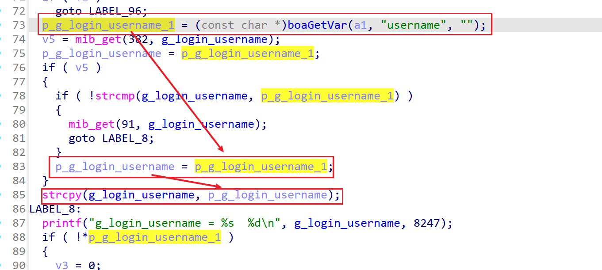
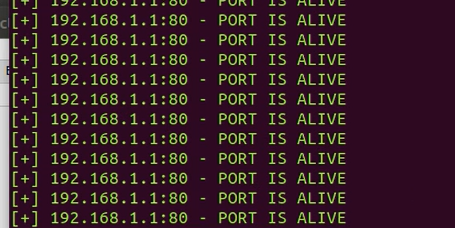
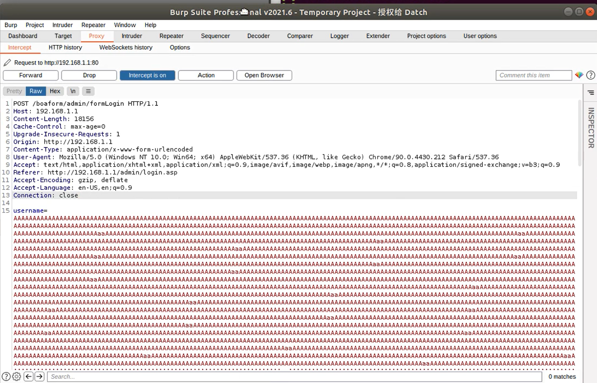
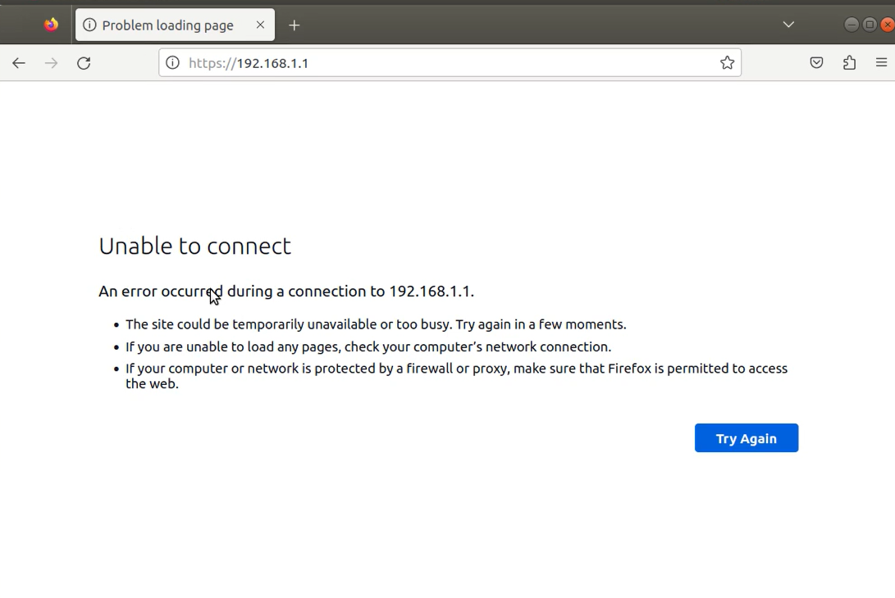

# TARGET

**Product:** Tenda HG10
 **Model:** AC1200 Dualband Wi-Fi xPON ONT
 **Vendor:** Tenda Technology
 **Official Website:** https://www.tendacn.com/
 **Firmware Version:** HG7_HG9_HG10re_300001138

# BUG TYPE

**Buffer Overflow Vulnerability**

# Abstract

A buffer overflow vulnerability exists in the Tenda HG10 AC1200 Dualband Wi-Fi xPON ONT router. The vulnerability is located in the Boa web server's `formLogin` interface and is related to the handling of the `username` parameter. Because the user-controllable parameter is copied without sufficient length validation, a remote attacker can submit an overlong value through a crafted HTTP request. Successful exploitation may cause a denial-of-service condition and could potentially lead to arbitrary code execution depending on memory layout and runtime protections.

# Details

The Boa web server's `formLogin` function was analyzed using IDA Pro.
The function entry address identified in the analysis is `0x00456EE8`.
The `username` parameter is obtained from the HTTP request and later copied into a fixed-size buffer. The unsafe copy operation does not verify that the destination buffer is large enough for the supplied value, so an overlong request can overwrite adjacent memory.

Relevant code patterns observed in the disassembly include:

```c
strcpy(g_login_username, p_g_login_username);
boaGetVar(a1, "username", "")
```



# POC

The affected endpoint is `POST /boaform/formLogin HTTP/1.1`.

The crafted request used during verification is shown below:

```http
POST /boaform/formLogin HTTP/1.1
Host: 192.168.1.1
```

Before the attack, the target device is in a normal state.

The malicious request is sent to the target device using Burp Suite.

After the request is processed, the router stops responding, confirming a denial-of-service condition.







