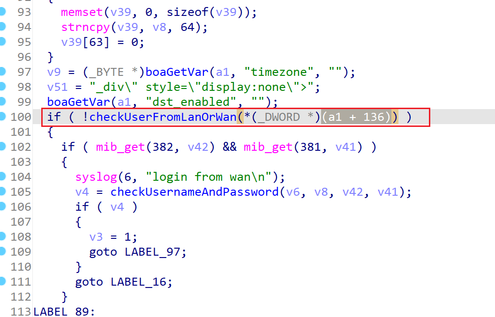
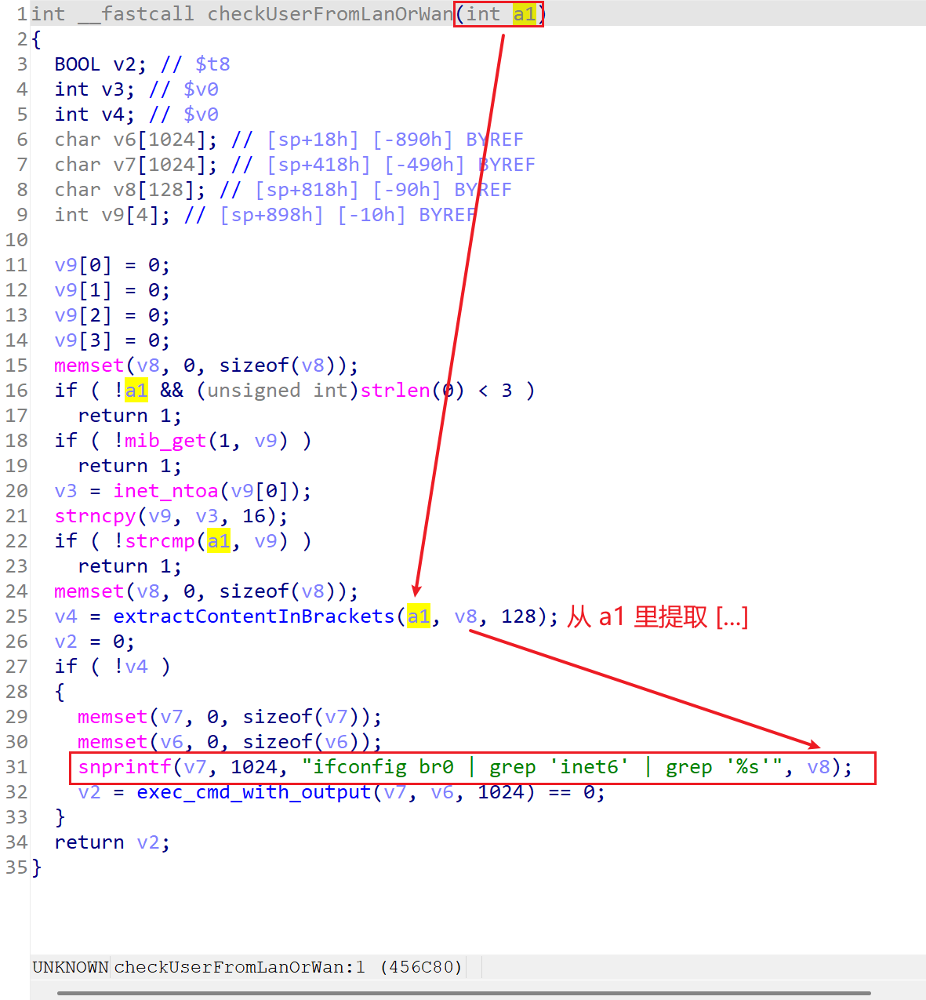
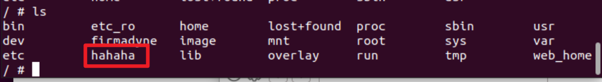

# TARGET

**Product:** Tenda HG10
 **Model:** AC1200 Dualband Wi-Fi xPON ONT
 **Vendor:** Tenda Technology
 **Official Website:** https://www.tendacn.com/
 **Firmware Version:** HG7_HG9_HG10re_300001138

# BUG TYPE

**Command Execution Vulnerability (Command Injection)**

# Abstract

A command execution vulnerability exists in the Tenda HG10 AC1200 Dualband Wi-Fi xPON ONT router.
 The vulnerability is located in the Boa web server’s `formLogin` interface and is specifically related to the handling of the `Host` parameter. Due to insufficient input validation and filtering of this user-controllable parameter, an attacker can inject arbitrary system commands through specially crafted requests. By exploiting this vulnerability, an unauthenticated attacker is able to execute arbitrary commands on the affected device.

# Details

The Boa web server’s `formLogin` function was analyzed using IDA Pro. At approximately line 100 of the disassembled code, a command injection vulnerability was identified. Further analysis focuses on the `checkUserFromLanOrWan` function.



The primary purpose of the `checkUserFromLanOrWan(int a1)` function is to determine whether a request originates from the LAN or the WAN:

- If the request IP matches the device’s LAN IPv4 address, it is considered a LAN request and the function returns 1.
- If the request contains an IPv6 address in the form `[xxxx]`, the function extracts the IPv6 address using `extractContentInBrackets` and then checks whether this IPv6 address belongs to the `br0` interface using the `ifconfig` command. If it belongs to `br0`, the function returns 1; otherwise, it returns 0.



From the disassembled code, it can be observed that the `Host` parameter is obtained directly from user input and stored at offset `a1 + 136`. The following command is then constructed:

```
snprintf(v7, 1024, "ifconfig br0 | grep 'inet6' | grep '%s'", v8);
```

The user-controlled parameter at `a1 + 136` (i.e., the `Host` parameter) is directly injected into the shell command `ifconfig br0 | grep 'inet6' | grep '%s'` without proper sanitization.

The `exec_cmd_with_output` function executes the command string stored in `v7`, effectively invoking the system shell. If an attacker injects malicious commands into the `Host` parameter, these commands may be interpreted by the shell as command separators or background execution operators.

# POC


Before the attack, it can be observed that the directory named `hahaha` does not exist on the device’s file system.

The malicious request is sent to the target device using the BurpSuite tool.



After the request is processed, the `hahaha` directory is successfully created on the device. This confirms that the injected command has been executed successfully and demonstrates the existence of the command injection vulnerability.

