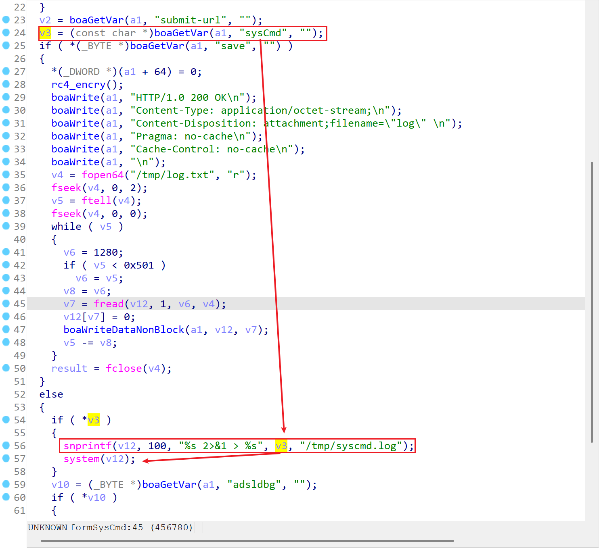
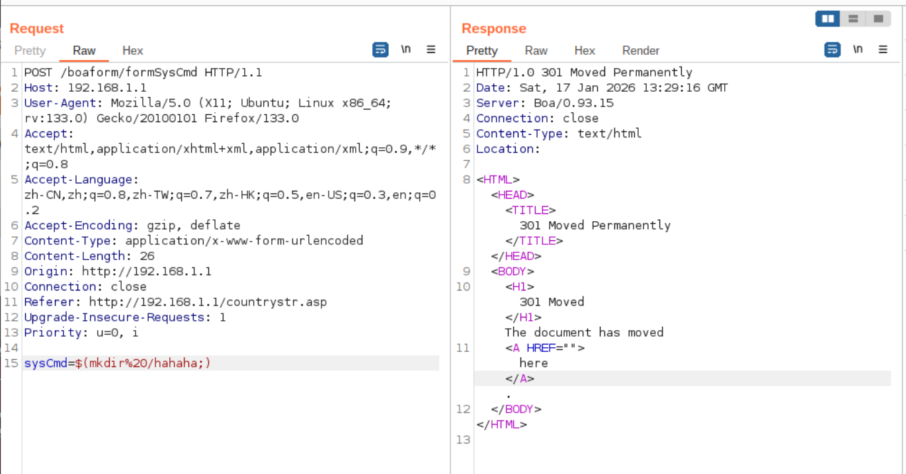
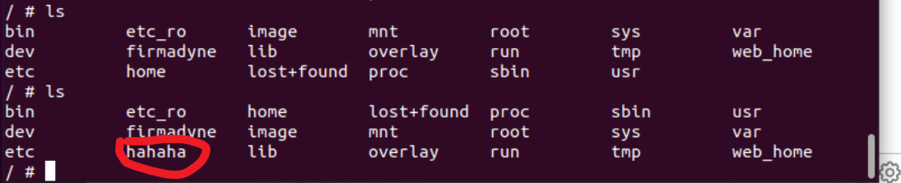

# TARGET

**Product:** Tenda HG10
 **Model:** AC1200 Dualband Wi-Fi xPON ONT
 **Vendor:** Tenda Technology
 **Official Website:** https://www.tendacn.com/
 **Firmware Version:** HG7_HG9_HG10re_300001138

# BUG TYPE

**Command Execution Vulnerability (Command Injection)**

# Abstract

A a command execution vulnerability exists in the Tenda HG10 AC1200 Dualband Wi-Fi xPON ONT router.
 The vulnerability is located in the Boa web server’s `formSysCmd` interface and is related to improper handling of the `sysCmd` parameter. Because the system fails to apply sufficient input validation and filtering to this user-controllable parameter, an attacker can inject arbitrary system commands through specially crafted requests. 

------

# Details

The Boa web server’s `formSysCmd` function was analyzed using IDA Pro.



From the disassembled code, it can be observed that the `sysCmd` parameter is obtained directly from user input via the `boaGetVar(a1, "sysCmd", "")` function and stored in the variable `v3`. When the request does not enter the `save` branch and the `sysCmd` parameter is not empty, the program executes the following logic:

```
snprintf(v12, 100, "%s 2>&1 > %s", v3, "/tmp/syscmd.log");
system(v12);
```

This shows that the user-controllable `sysCmd` parameter is directly concatenated into the command string `v12` and executed via the `system()` function. Because no effective input validation, filtering, or escaping is applied to `sysCmd` prior to execution, an attacker can inject additional shell syntax—such as command separators or redirection operators—into the parameter.

# POC



