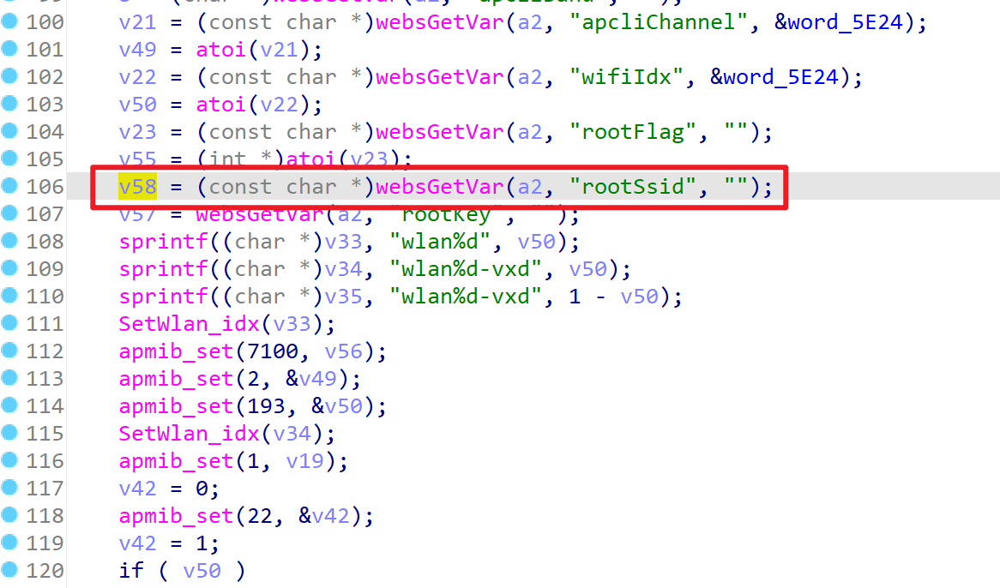
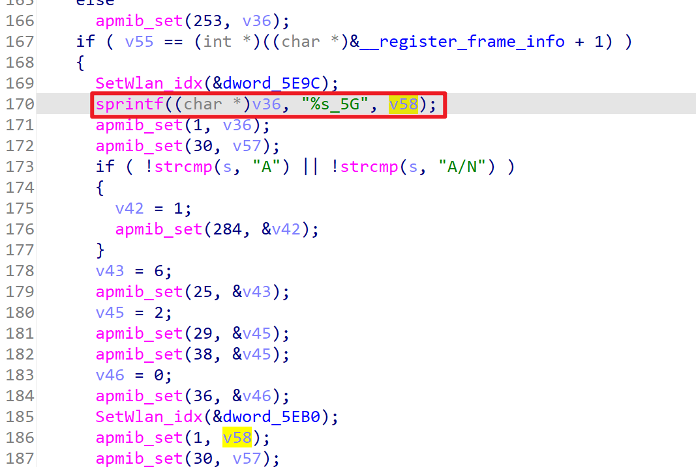
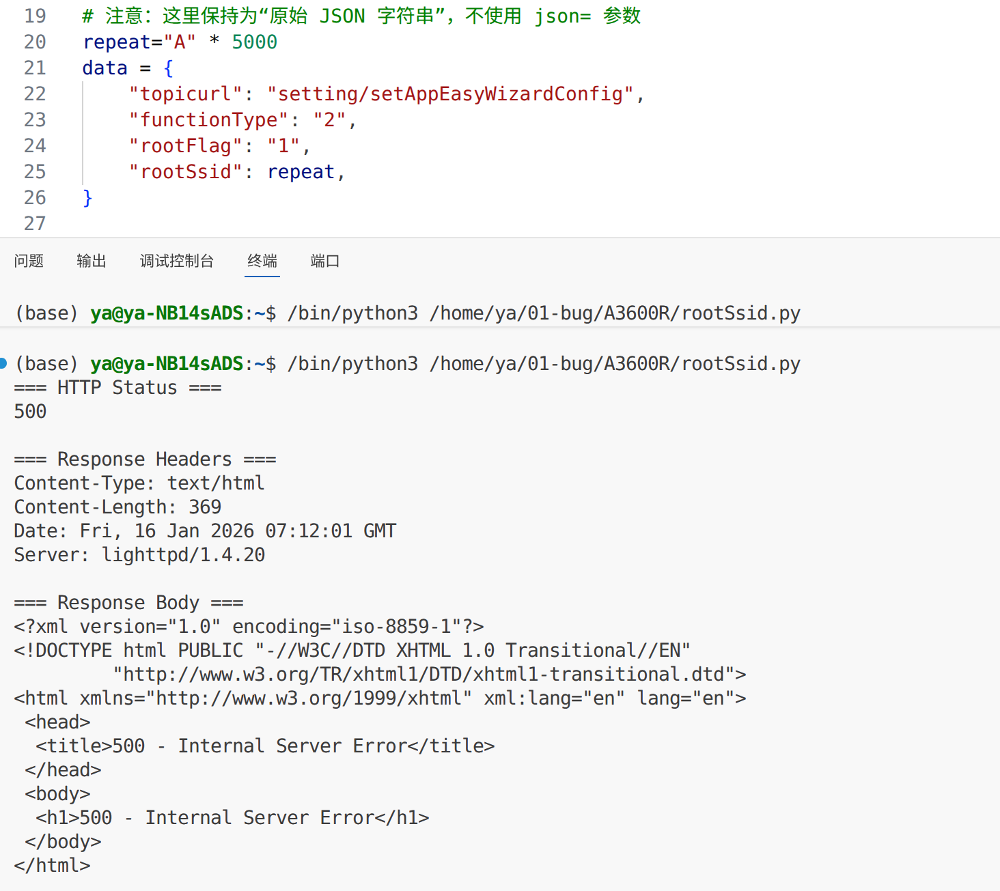

# TARGET

TOTOLink A3600R Router

# BUG TYPE

Buffer Overflow

# Abstract

The TOTOlink A3600R router, firmware version V5.9c.4959, contains a buffer overflow vulnerability in the `setAppEasyWizardConfig` interface of `/lib/cste_modules/app.so`. The vulnerability occurs because the `rootSsid` parameter is not properly validated for length, allowing remote attackers to trigger a buffer overflow, potentially leading to arbitrary code execution or denial of service.

# Details

**Environment:**

* Device: TOTOlink 3600R
* Firmware version:  V5.9c.4959
* Manufacturer: [https://www.totolink.net/](https://www.totolink.net/)

**Vulnerability Analysis:**

In `setAppEasyWizardConfig`, the program reads the `rootSsid` parameter from the HTTP request  and copies it into a fixed-size stack buffer `v36` in a specific branch:

- `v36` is defined as `_DWORD v36[8]`, which corresponds to a 32-byte stack buffer;
- When the branch condition is met (i.e., `functionType >= 2` and `rootFlag == 1`), the following code is executed:

```
sprintf((char *)v36, "%s_5G", v58);  // v58 = rootSsid
```

- `sprintf` does not perform length checking. It will continue writing until the content is fully written and the null terminator `\0` is added. If the output length exceeds the actual size of `dst`, it will write beyond the buffer bounds, overwriting adjacent memory, leading to stack overflow/crash, or even control flow hijacking under certain conditions.





# POC



