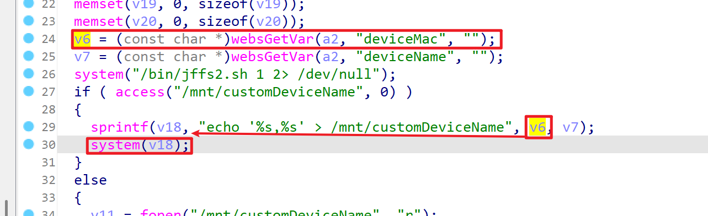
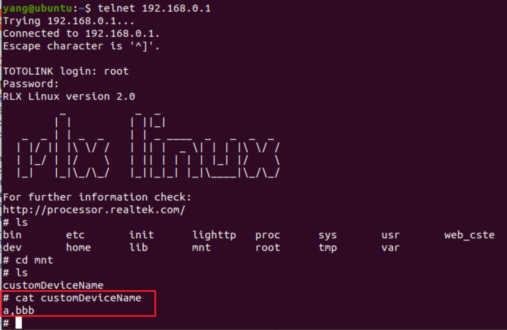

# TARGET
- Device: TOTOlink A950RG Router
- Firmware version : V4.1.2cu.5204_B20210112

# BUG TYPE
Command Execution Vulnerability

# Abstract
The TOTOlink A950RG router contains a command execution vulnerability in the setDeviceName interface of the /lib/cste_modules/global.so library, specifically in the processing of the deviceMac parameter. Due to insufficient input validation and filtering of user-controllable parameters, attackers can inject system commands through specially crafted malicious requests to the deviceMac parameter. By exploiting this vulnerability, unauthorized attackers can execute arbitrary system commands, thereby gaining control over the affected router device.

# Details



The vulnerability exists in the setDeviceName function of the global.so library. Analysis of the disassembled code reveals that the deviceMac parameter is retrieved from user input via the websGetVar function and stored in variable v6. The system then executes the command '/bin/jffs2.sh 1 2> /dev/null'. If the file '/mnt/customDeviceName' does not exist, the code constructs a command string v18 containing the deviceMac value and executes it using the system function to write these values to the '/mnt/customDeviceName' file.

The sprintf() function formats a string into the v18 buffer with the format string "echo '%s,%s' > /mnt/customDeviceName", where the first %s is replaced with the value of v6 (the user-supplied deviceMac parameter). The system() function then executes the command string in v18. If an attacker injects malicious commands into variable v6 (the deviceMac parameter), such as instructions to start the telnet service, these commands will be directly concatenated into the system call and executed.

When the single quote after echo is prematurely closed, the ";" and "&" characters are exposed outside of the single quotes, and they are interpreted by the shell as command separators and background execution symbols respectively. When the router executes system(v18), it not only processes the original device name saving function but also executes the injected malicious commands, potentially activating services that were previously turned off or performing other unauthorized operations.

Due to the lack of sufficient validation and filtering of user input before executing the system command, conditions for command injection attacks are created. Attackers can exploit this command execution vulnerability by sending specially crafted API requests with malicious commands injected into the deviceMac parameter, potentially resulting in complete system compromise.

# POC
Through BurpSuite packet capture tool, we can intercept data packets between the frontend and backend. By analyzing the packet structure, we can construct HTTP request packets containing command injection and send the requests. Through analysis of the returned packets, we can confirm the results of malicious command execution, thereby verifying the existence and exploitation effect of the vulnerability.

```

"deviceMac" : "a',; telnetd &# ",
"deviceName":  "bbb"
```

As shown in the results, the command injection was successful, and the target router device supports Telnet service, allowing shell access to the device via Telnet.

