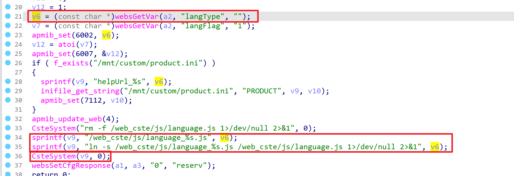

# TARGET
TOTOlink A950RG Router with firmware version V4.1.2cu.5204_B20210112

# BUG TYPE
Command Execution Vulnerability

# Abstract
The TOTOlink A950RG router contains a command execution vulnerability in the `setLanguageCfg` interface of the `/lib/cste_modules/global.so` library, specifically in the processing of the` langType` parameter. Due to insufficient input validation and filtering of user-controllable parameters, attackers can inject system commands through specially crafted malicious requests to the` langType` parameter. By exploiting this vulnerability, unauthorized attackers can execute arbitrary system commands, thereby gaining control over the affected router device.

# Details



The vulnerability exists in the setLanguageCfg function of the global.so library. Analysis of the disassembled code reveals that the sprintf() function formats a string into the v9 buffer with the format string 'ln -s /web_cste/js/language_%s.js /web_cste/js/language.js 1>/dev/null 2>&1', where %s is replaced with the value of v6 (the user-supplied langType parameter). The CsteSystem() function then executes the command string in v9, calling the system to execute this command.

If an attacker injects malicious commands into variable v6 (the langType parameter), such as instructions to start the telnet service, these commands will be directly concatenated into the system call and executed. When the router executes CsteSystem(v9, 0), it not only processes the original language configuration functionality but also executes the injected malicious commands, potentially activating services that were previously disabled or performing other unauthorized operations.

Due to the lack of sufficient validation and filtering of user input before executing the CsteSystem command, conditions for command injection attacks are created. Attackers can exploit this command execution vulnerability by sending specially crafted API requests with malicious commands injected into the langType parameter, potentially resulting in complete system compromise.

# POC
Through BurpSuite packet capture tool, we can intercept data packets between the frontend and backend. By analyzing the packet structure, we can construct HTTP request packets containing command injection and send the requests. Through analysis of the returned packets, we can confirm the results of malicious command execution, thereby verifying the existence and exploitation effect of the vulnerability.

```

"langType" : "; telnetd &# "}
```

As shown in the results, the command injection was successful, and the target router device supports Telnet service, allowing shell access to the device via Telnet. Before the attack, the Telnet service was disabled, but after sending the crafted request with the injected command, the service was activated, confirming the vulnerability's existence and impact.

