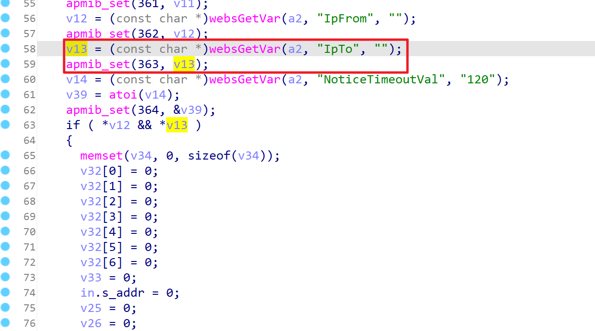
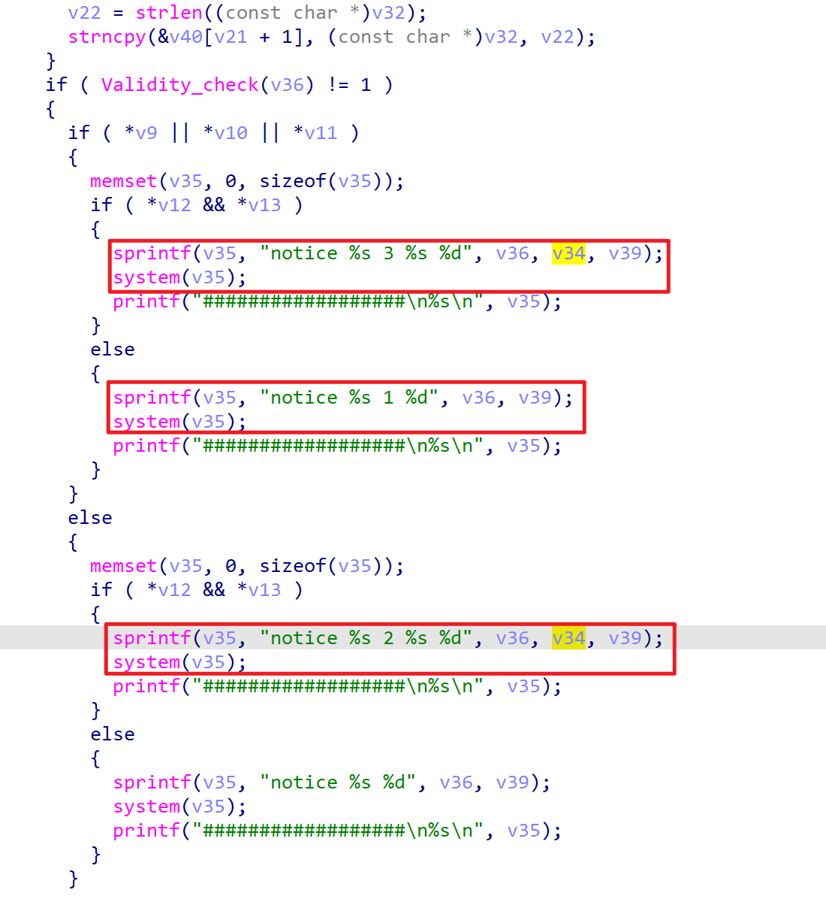
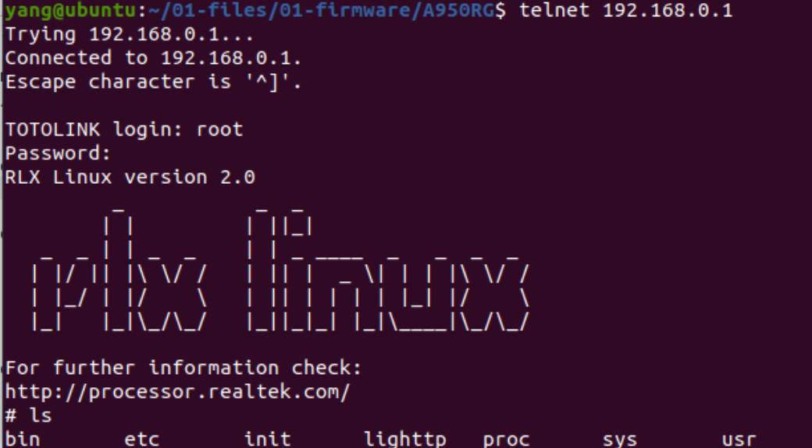

# TARGET

TOTOlink A950RG Router with firmware version V4.1.2cu.5204_B20210112

# BUG TYPE
Command Execution Vulnerability

# Abstract
A command execution vulnerability exists in the TOTOlink A950RG router running firmware version V4.1.2cu.5204_B20210112. The vulnerability is located in the setNoticeCfg interface within the /lib/cste_modules/system.so library, specifically in the processing of the IpTo parameter. Due to insufficient input validation and filtering of this user-controllable parameter, attackers can inject system commands through carefully crafted malicious requests to the IpTo parameter. By exploiting this vulnerability, unauthorized attackers can execute arbitrary system commands on the target device, thereby gaining control over the affected router.

# Details



The vulnerability is found in the setNoticeCfg function within the system.so library. Analysis of the disassembled code reveals that the IpTo parameter is retrieved from user input through the websGetVar function and then passed to the apmib_set function for data storage. If both IpFrom and IpTo parameters have values, the code constructs a string v34 containing the value of IpTo.



The sprintf() function writes a formatted string into the v35 buffer with the format string "notice %s 3 %s %d". The first %s is replaced with the value of v36, the second %s is replaced with v34 (the user-input IpTo parameter), and %d is replaced with the integer value of v39. The system() function then executes the command string in v35, calling the system to execute this command.

If an attacker injects malicious commands into the variable v34 (the IpTo parameter), such as instructions to start the telnet service, these commands will be directly concatenated into the system call and executed. When the router executes system(v35), it not only processes the original network configuration functionality but also executes the injected malicious commands, potentially activating services like telnet that were previously disabled.

# POC
```
"NoticeEnabled":"1","NoticeUrl":"www.111.COM","BtnName":"Click here to continue","WhiteListUrl1":"","WhiteListUrl2":"","WhiteListUrl3":"","IpFrom":"2","IpTo":"; telnetd &# ","NoticeTimeoutVal":"120"}
```



By sending this specially crafted API request, attackers can inject malicious commands into the IpTo parameter to exploit the command execution vulnerability, potentially leading to complete system compromise. In this example, the injection of "; telnetd &# " activates the telnet service that was previously disabled, creating an unauthorized remote access entry point. Since the router runs these commands with root privileges, once the telnet service is activated, attackers can log into the device via port 23, gain full command-line access, and execute arbitrary system operations. This not only threatens the security of the device itself but may also lead to credential theft, network traffic monitoring, sensitive data interception, and even use of the device as a stepping stone to attack other systems, further endangering the entire network environment connected to the router.